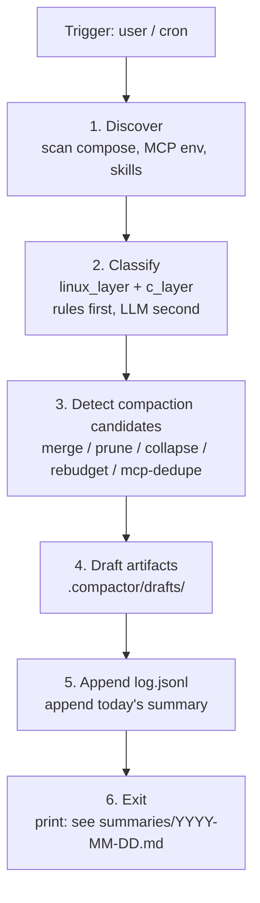
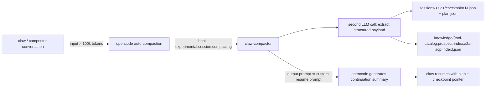

# AGENTS.md — `opencode_claw` compactor runbook

> **Scope of this file.** This is the runbook for the two opencode agents
> that live next to this folder: [`claw`](../../.opencode/agent/claw.md)
> (the stateless writer) and [`composter`](../../.opencode/agent/composter.md)
> (the stateful reader). It defines the operating envelope, the five
> compaction axes, the pipeline, schemas, hard/soft constraints,
> acceptance tests, and the user-facing commands.
>
> Read this **before any action**. The agent definitions are intentionally
> short; they delegate to this file.
>
> Companion documents:
> [`PLAN.md`](./PLAN.md) ·
> [`opinion1.md`](./opinion1.md) ·
> [`RELATED_WORK.md`](./RELATED_WORK.md) ·
> [`../docs/skills-options.md`](../docs/skills-options.md) ·
> [`../docs/mcp-options.md`](../docs/mcp-options.md) ·
> [`../../.ai/AGENTS.md`](../../.ai/AGENTS.md) ·
> [agents.md format](https://agents.md/).

---

## 1. Operating envelope

- **Scan scope = current opencode project worktree.** Determine it at
  session start with `pwd`. Two common cases:
  - **Project worktree** (e.g. `/home/user/projects/first`) — scan that
    project only. Use the project-relative scanners in §4.
  - **Host worktree `/`** (the opencode "global" project) — scan the
    entire host. Use both the project-relative scanners AND the
    host-wide scanner paths listed in §4. Do NOT confine yourself to
    one sub-directory (e.g. `/home/user/projects/first`) just because
    that's where the runbook and the plugin live — the runbook is the
    *contract*, not the scan target.
- The plugin always writes `.compactor/{sessions,knowledge}/` under the
  repository that hosts this file (`/home/user/projects/opencode+/opencode_claw/.compactor/`),
  regardless of the agent's worktree. That path is the audit-trail
  destination, not a scan boundary.
- **`.ai/` is read-only** for both agents. Skills are never edited
  in-place; proposals land in
  [`.compactor/drafts/`](./.compactor/drafts/) and reach `.ai/skills/`
  only through skills-manager publish or a human-reviewed PR.
- **Audit-trail directory:** [`.compactor/`](./.compactor/) — see its
  [README](./.compactor/README.md) for the per-file producer/consumer
  contract.
- **LLM gateway:** LiteLLM at `http://127.0.0.1:4000/v1`. Agent runtimes
  must not invent other URLs.
- **MCP cycle guard:** never delegate to `opencode-adapter` from inside
  opencode (header `X-Agent-Mesh-Depth`, see
  [`../../.ai/AGENTS.md`](../../.ai/AGENTS.md) §1). The compactor never
  proposes a `merge` or `prune` that would re-introduce such a cycle.
- **Stateless writer + stateful reader.** `claw` MUST NOT read its own
  editorial outputs; `composter` MUST NOT write. `claw` persists discovery
  through registry snapshots and immediate Neo4j sync, not through
  auto-compaction checkpoints. This is enforced both in this runbook and
  in the agent `permission` blocks.

---

## 2. Compaction taxonomy — the five axes

Every compaction action belongs to exactly one of the five axes below
and produces exactly one entry in
[`.compactor/log.jsonl`](./.compactor/log.jsonl) (schema:
[`schemas/compaction-action.schema.json`](./schemas/compaction-action.schema.json)).

| Axis | Signal (how `claw` detects a candidate) | Required evidence | Gate |
|------|------------------------------------------|--------------------|------|
| **`merge`** | Two skills overlap on triggers (≥ 50% Jaccard) **and** their procedures share an extractable step. | ≥ 2 `path:line` anchors per skill (frontmatter + procedure). | Human review of merged draft. |
| **`prune`** | A skill or MCP server is unreferenced: not in any `triggers`, not in `router.md`, not used by any session in the last *N* days (default 14). | One anchor per "no incoming reference" claim plus the registry snapshot. | Human review **and** smoke probe (`tools/list` returns empty / fails). |
| **`collapse`** | A `linux_layer` from [`PLAN.md §2`](./PLAN.md#2-концепция-linux-boot-как-модель-иерархии-skills) has only one inhabitant whose body is < 30 lines, so the L*n* tier is structural noise. | Anchor showing the thin layer + the parent layer. | Human review of new frontmatter `linux_layer:` value. |
| **`rebudget`** | Skill body > 8 KB or whole-skill load is unconditional, but only the frontmatter is needed at routing time. | Anchor of the heavy section + measured token count. | Human review; goal `system-prompt skills+MCP ≤ 8 000 tokens`. |
| **`mcp-dedupe`** | Two MCP servers expose tools with identical signatures (e.g. `searchbox.search` and `web.search`), or two namespaces collide. | Anchors of both `tools/list` outputs **or** both compose configs. | Human review; usually ends in a `prune` follow-up after consolidation. |

Each entry must satisfy `compaction-action.schema.json` — including the
HARD `evidence: ["path:line", ...]` constraint with `minItems: 1`.

---

## 3. Pipeline



**HARD invariant.** Between steps 1 and 6 the agent MUST NOT read
`.compactor/log.jsonl` or `.compactor/summaries/**`. Discovery always
starts from a fresh repository state. This is enforced by `claw`'s
`permission.read` deny-list — see
[`../../.opencode/agent/claw.md`](../../.opencode/agent/claw.md).

Per-step responsibilities:


1. **Discover** — run all scanners in §4, write a registry snapshot to
   `.compactor/registry/integrations.<ts>.json`. This registry is the
   primary source for Neo4j projection; do not wait for auto-compaction
   checkpoints to persist discovery facts.
2. **Classify** — assign `linux_layer` and `c_layer` per §5; rules
   first, LLM only for tie-breaks.
3. **Detect** — apply the five-axis rules from §2; collect candidates.
4. **Draft** — for each `merge` / `collapse` / `rebudget` write a draft
   under `.compactor/drafts/<op-id>/`; for `prune` and `mcp-dedupe`
   include the proposal text inside the log entry rationale.
5. **Log** — append one JSON line per candidate to `log.jsonl`; append
   a human-readable section to `summaries/YYYY-MM-DD.md`.
6. **Sync to Neo4j** — project all discovery facts into the graph (see
   §13). Run from repo root immediately after every registry snapshot
   (including `discover only`; adjust `<sid>` and registry path):

   ```bash
   node opencode+/plugins/claw-neo4j/sync-from-compactor.js \
     --session <current_sid> \
     --registry opencode+/opencode_claw/.compactor/registry/integrations.<ts>.json
   ```

   If Neo4j is down, log the skip and continue — JSON `.compactor/` remains
   authoritative. Set `NEO4J_ENABLED=0` to disable sync entirely.
7. **Verify projection** — query or report `MATCH (t:Tool) RETURN count(t)`
   and compare it with `registry.records.length`. Explain any rejected or
   unprojected records before exiting.
8. **Exit** — print the summary path. Never re-enter the loop.

---

## 4. Discovery scanners

Mirrors [`PLAN.md §4.3`](./PLAN.md#43-discovery-scanners-источники-истины).

| Scanner | What it reads | What it extracts |
|---------|----------------|-------------------|
| `compose` | `compose.*.yml` | services, ports, networks, mounts |
| `mcp` | `OPENCODE_MCP_SERVERS`, `~/.config/opencode/opencode.json`, `opencode+/configs/opencode.litellm-dual.json` | MCP name, type, url, `tools/list` surface → `mcp_usage` JSON per [`schemas/tool-node.schema.json`](./schemas/tool-node.schema.json) |
| `skills` | `.ai/skills/*/SKILL.md`, `.ai/router.md` | id, triggers, mcp_servers, agents |
| `env` | `.env*`, `opencode+/.env`, `opencode+/configs/profiles/*.env` | key names (values redacted), URLs, ports |
| `scripts` | `opencode+/*.sh`, `stack-start.sh` | start order, dependencies |
| `arch` | `arch/**`, `docs/*.md` | documented integrations |
| `health` | HTTP `*/healthz`, `*/health` | live/dead |
| `litellm` | `docker/litellm/config.yaml` | model aliases, api_base |
| `process` | `docker ps`, `*.pid` | running state |

### Neo4j Tool fields

Each discovery record SHOULD carry the canonical fields used by
`tool-node.schema.json` and `claw-neo4j`:

- Required for a useful `Tool`: `id`, `tool_dir`, `name`, `description`, `type`,
  `target`, `mcp_usage`.
- Preserve when supported by evidence: `endpoint`, `c_layer`, `linux_layer`,
  `confirmations`, `status`, `evidence`, `_reserved`.
- `mcp_usage` is a JSON string. For MCP servers it should include the
  `tools/list` surface, including schemas when available. For non-MCP records,
  store a small JSON string explaining why no MCP surface exists.
- `evidence` anchors must resolve to `path:line` or `path:line-range`; records
  without evidence are not ready for Neo4j projection.

### Host-wide scanners (only when worktree = `/`)

When `pwd` returns `/` (opencode "global" project), additionally run
these absolute-path scanners. Each line is a concrete shell recipe;
use it verbatim or adapt. Do not stop at the first hit — collect from
**all** directories.

| Scanner | Recipe (absolute paths) | What it extracts |
|---------|-------------------------|-------------------|
| `host-bins` | `ls /usr/local/bin /usr/bin /bin /sbin /usr/local/sbin /opt 2>/dev/null` | executables (LLMs, mcp shims, agent CLIs) |
| `host-home` | `find /home -maxdepth 5 \( -name "*.opencode*" -o -name "AGENTS.md" -o -name "SKILL.md" -o -name "mcp*.json" -o -name ".mcp.json" -o -name "*.service" \) 2>/dev/null` | per-user agent configs, skills, MCP, systemd units |
| `host-etc` | `ls /etc/opencode* /etc/claude* /etc/mcp* 2>/dev/null; ls /etc/systemd/system/ 2>/dev/null \| head -100` | system-wide agent configs + installed systemd units |
| `host-opt` | `ls /opt 2>/dev/null && find /opt -maxdepth 3 -name "*.service" -o -name "*.json" -o -name "*.sh" 2>/dev/null \| head -60` | third-party installs (LM Studio, Ollama, etc.) |
| `host-xdg` | `ls ~/.config ~/.local/share ~/.cache/opencode 2>/dev/null; find ~/.config -maxdepth 3 -name "opencode*" -o -name "claude*" -o -name "mcp*" 2>/dev/null` | XDG dirs for agents, MCP, model configs |
| `host-systemd` | `systemctl list-units --type=service --all --no-pager 2>/dev/null \| head -80; systemctl --user list-units --type=service --all --no-pager 2>/dev/null \| head -40` | running/installed services (use `--no-pager`) |
| `host-docker` | `docker ps --format '{{.Names}}\t{{.Image}}\t{{.Ports}}' 2>/dev/null; docker compose ls 2>/dev/null` | running stacks across the host |
| `host-git` | `find /home -maxdepth 4 -name ".git" -type d 2>/dev/null \| head -40` | other agent/MCP projects under home |

Notes:
- `/root`, `/var/lib/docker`, and `/proc` are ACL-restricted to `root`;
  catalog them with `path: ".../<denied>"` and `evidence: "EACCES"`
  instead of silently dropping them.
- Always use absolute paths in `bash` and `read` calls. Even with
  `cwd=/`, relative paths can resolve unpredictably across tools.

### Redact list (mandatory)

Before a scanner emits any value into a registry record, redact values
of keys matching any of:

```
*_API_KEY     *_TOKEN       *_SECRET
*_PASSWORD    *_PASSWD      *_PRIVATE_KEY
HF_TOKEN      OPENAI_API_KEY    ANTHROPIC_API_KEY
```

Only the **key name** survives in `config_keys[]`; the value is dropped.
This applies recursively when reading `.env*` files. See
[`integration-record.schema.json`](./schemas/integration-record.schema.json)
field `config_keys`.

---

## 5. Classification rules

Two axes, both optional but encouraged:

- `linux_layer` ∈ `{L0..L12}` — the Linux-boot taxonomy from
  [`PLAN.md §2`](./PLAN.md#2-концепция-linux-boot-как-модель-иерархии-skills).
- `c_layer` ∈ `{C0..C4}` — see
  [`../docs/architecture-c1-c4.md`](../docs/architecture-c1-c4.md).

### Rules first (deterministic)

```
type=mcp                     → linux_layer=L6
type=compose-service         → linux_layer=L5  (init / systemd-equivalent)
type=skill, id matches existing flat skill (research, code-review, …)
                             → linux_layer=L11
type=env                     → linux_layer=L3
type=script, path matches stack-start*  → linux_layer=L5
type=script, path matches start-*.sh    → linux_layer=L2
type=llm-model               → linux_layer=L6
type=lsp                     → linux_layer=L6
endpoint matches *://*:3400  → linux_layer=L12 (shell / UI)
```

For `c_layer`, the default mapping is `compose → C2`, `mcp → C4`,
`skill → C4`, `env/script → C1`. Override only with explicit evidence.

### LLM fallback

If no rule matches, the agent may consult its model with the
**rule-or-abstain** prompt: *"Pick `Ln` (n in 0..12) only if you can
cite a `path:line` anchor from the registry; otherwise return null."*
Record the LLM tie-break decision in the registry record's `evidence`
array.

---

## 6. Audit trail schema

Two schemas in [`schemas/`](./schemas/):

- [`compaction-action.schema.json`](./schemas/compaction-action.schema.json)
  — every JSONL entry in `.compactor/log.jsonl`.
- [`integration-record.schema.json`](./schemas/integration-record.schema.json)
  — every record in `.compactor/registry/integrations.<ts>.json`.

### Storage paths and retention

| Path | Format | Retention | Producer | Consumer |
|------|--------|-----------|----------|----------|
| `.compactor/log.jsonl` | JSON Lines | local-only, never rotated automatically | `claw` (append) | `composter` (read-only) |
| `.compactor/registry/integrations.<ts>.json` | JSON | last 30 snapshots locally | `claw` discovery | `claw` (next session, fresh diff), `composter` |
| `.compactor/summaries/YYYY-MM-DD.md` | Markdown | committed forever | `claw` (append) | humans, `composter`, PR review |
| `.compactor/drafts/<op-id>/` | Markdown / YAML | committed until applied or rejected | `claw` | humans, skills-manager |

Example log entry (informative, validate against the schema):

```json
{
  "id": "act_2x5q9p",
  "ts": "2026-05-25T19:32:00+03:00",
  "session_id": "ses_abc123",
  "op": "merge",
  "targets": [".ai/skills/research", ".ai/skills/code-review"],
  "rationale": "triggers overlap 4/6; procedures share evidence-gathering step",
  "evidence": [".ai/skills/research/SKILL.md:14-22", ".ai/skills/code-review/SKILL.md:8-15"],
  "proposed_artifact": "opencode+/opencode_claw/.compactor/drafts/act_2x5q9p/SKILL.md",
  "human_gate": "pending",
  "model": "litellm/qwen3.6-35b-heretic",
  "summary_ref": "summaries/2026-05-25.md#merge-research-code-review",
  "registry_snapshot": "opencode+/opencode_claw/.compactor/registry/integrations.2026-05-25T19-30-00+03-00.json"
}
```

---

## 7. Constraints

### HARD (CI- or permission-enforced)

1. **`claw` cannot read `.compactor/log.jsonl` or
   `.compactor/summaries/**`.** Enforced by `permission.read.deny`
   in [`claw.md`](../../.opencode/agent/claw.md). This prevents the
   stateless writer from rationalising past mistakes.
2. **No agent writes to `.ai/skills/` directly.** Enforced by
   `permission.edit` on both agents. Publish flows only via
   skills-manager (`POST /skills`) or a human-reviewed PR.
3. **MCP cycle guard.** No proposal may re-introduce
   `opencode-adapter → opencode-adapter`. The `mcp-dedupe` axis must
   reject any merge that fans out from `opencode-adapter` into itself.
4. **Evidence required.** Every log entry has
   `evidence.minItems: 1` (`path:line` regex enforced by
   [`compaction-action.schema.json`](./schemas/compaction-action.schema.json)).
   The same rule applies to every element of `tools_found[]`,
   `prospects[]`, `a2a_acp[]` in
   [`checkpoint.schema.json`](./schemas/checkpoint.schema.json) (see §12).
5. **Secret redaction.** `config_keys` carries names only; values
   matching the §4 denylist must never appear in `registry/*.json`,
   `sessions/<sid>/**`, or `knowledge/*.json`.
6. **`knowledge/*.json` is append-only.** Owned by the
   [`claw-compactor`](../plugins/claw-compactor/index.js) plugin. New
   `confirmations` / `last_seen_session` may be updated; existing
   facts (`kind`, `first_seen_session`, `evidence[]`, `transport`,
   `endpoint`) MUST NOT be overwritten. Enforced by the plugin's
   `mergeAppend()` helper and by the per-file schemas in
   [`schemas/`](./schemas/).
7. **Session checkpoints are not a `claw` resume path.** `claw` MAY read
   `.compactor/knowledge/**` (the accumulated fact base), but normal
   `claw` discovery persists through `registry/integrations.<ts>.json`
   followed by Neo4j sync. Cross-session checkpoint reads belong to
   `composter` and to the plugin itself.

### SOFT (metric / budget targets)

6. **Hallucinated evidence < 5 %** in `composter`-driven spot checks
   over a rolling 30-day window (anchors must resolve to real lines).
7. **Single `claw` session ≤ 30 min wall-clock.** If exceeded, abort
   gracefully — partial progress to `summaries/` is OK; partial
   `log.jsonl` is OK because the file is append-only.
8. **System-prompt budget for skills + MCP ≤ 8 000 tokens** (drives the
   `rebudget` axis; lazy-load skill bodies once exceeded).

---

## 8. Tests / acceptance criteria

| # | Test | Pass criterion |
|---|------|----------------|
| T1 | **Registry coverage** — every service in `compose.*.yml` and every MCP server in opencode config appears in the latest registry snapshot | ≥ 95 % match rate |
| T2 | **Drift detection** — diff `registry/integrations.<latest>.json` against a fresh discovery on the current working tree | empty diff |
| T3 | **Schema validation (log)** — `jq -c '.' log.jsonl \| while read l; do ajv validate -s schemas/compaction-action.schema.json -d -; done` | every entry validates |
| T4 | **Schema validation (registry)** — `ajv validate -s schemas/integration-record.schema.json -d registry/integrations.<latest>.json` | every record validates |
| T5 | **Smoke MCP for `prune`** — for each proposed prune target, call the MCP server's `tools/list` (or hit its `/healthz`) | server is unreachable **or** `tools/list` is empty |
| T6 | **Merge-test** — after a `merge` draft is created, run frontmatter lint and triggers-uniqueness check on the draft `SKILL.md` | lint passes; `triggers[]` has no duplicates |
| T7 | **Permission integrity** — `opencode agent get claw` and `opencode agent get composter` show the deny-rules from §7 unchanged | no drift vs this file |
| T8 | **Stateless invariant** — confirm `claw`'s session never opens `.compactor/log.jsonl` (e.g. via `strace`/audit) | zero reads |
| T9 | **Plugin checkpoint** — run `composter` against a fixture session whose input exceeds the 100k-token threshold (e.g. by including a synthetic 110k-token transcript). The [`claw-compactor`](../plugins/claw-compactor/index.js) plugin fires `experimental.session.compacting`; `.compactor/sessions/<sid>/checkpoint.1.json` + `plan.json` appear; `knowledge/{tool-catalog,prospect-index,a2a-acp-index}.json` are created or extended | all JSON validate against the §12 schemas |
| T10 | **Append-only knowledge** — re-run T9 against the *same* inventory. The plugin's `mergeAppend()` increments `confirmations` and updates `last_seen_session`; no record is duplicated; existing `evidence[]` / `first_seen_session` are preserved | no record overwritten |
| T11 | **Resume semantics** — start a fresh `claw` session with no `sessions/<new_sid>/plan.json`. The agent must behave as a normal cold start (no error, no read of a foreign `sessions/<other>/plan.json`). Then place a hand-written `plan.json` and start another fresh session: the agent must begin from `plan.json.next_actions[0]` | cold-start succeeds; warm-start resumes |
| T12 | **Cross-session knowledge for composter** — after several checkpoints across different sessions, `composter explain --since 7d` cites `knowledge/tool-catalog.json` for tool claims rather than attempting to read `sessions/<other>/checkpoint.<n>.json` | no `sessions/<other>/` reads in the trace |
| T13 | **Neo4j projection** — after discover + sync (step 6), `MATCH (t:Tool) RETURN count(t)` in Neo4j Browser returns ≥ 1; `node opencode+/plugins/claw-neo4j/search.mjs tools -q mcp` returns hits when MCP servers exist | graph populated or explicit skip logged |

T1–T6 and T9–T11 are runnable; T7–T8 and T12 are part of code review on
changes to either agent file.

---

## 9. Commands

User-facing entry points (executed inside opencode TUI / Web UI / `opencode run`):

| Command | Agent | Purpose |
|---------|-------|---------|
| `/agents claw` then `compact` | `claw` | Run one full pipeline session. |
| `/agents claw` then `discover only` | `claw` | Run only steps 1–2; write registry snapshot, no detection. |
| `/agents composter` then `explain --since 7d` | `composter` | Summarise the last 7 days from the journal. |
| `/agents composter` then `explain action <id>` | `composter` | Deep-read of one log entry with evidence resolution. |
| `/agents composter` then `propose rollback <id>` | `composter` | Produce a unified-diff proposal; cannot apply. |

Hooks from
[`opencode+/start-opencode.sh`](../start-opencode.sh) already link
`.ai/` into the workspace; the agents work as soon as you switch to
them. No additional install step.

---

## 10. Anti-patterns

Drawn from [`opinion1.md`](./opinion1.md) and the OpenCode+ envelope
([`AGENTS.example.ru.md`](./AGENTS.example.ru.md)). **Never** do these:

- Run the compactor fully autonomously (cron + auto-publish). The human
  gate is the whole point.
- Trust LLM classification without rule-based first pass — go
  rules-first, LLM second, evidence always.
- Edit `.ai/skills/` directly. RO mount; propose a draft.
- Duplicate documentation. Skills are runbooks; docs are narrative;
  cross-link, don't copy.
- Read `.compactor/log.jsonl` from `claw`. The whole architecture
  collapses to "self-reflective writer" if you bypass this.
- Suggest `opencode-adapter` as the MCP server backing the `opencode`
  agent itself. That is the documented cycle bug.
- Commit `log.jsonl` or `registry/*.json` (gitignored — keep it that way).
- Publish a draft skill without `verified: false` until at least one
  smoke probe (T5 or T6) succeeds.

---

## 11. References

- [`PLAN.md`](./PLAN.md) — phases, pipeline, risks
- [`opinion1.md`](./opinion1.md) — feasibility on Qwen3.6-35B
- [`plan2.md`](./plan2.md) — optimised execution plan
- [`RELATED_WORK.md`](./RELATED_WORK.md) — external analogues
- [`PROMPT_CONTEXT.md`](./PROMPT_CONTEXT.md) — system-prompt context for `claw`
- [`../docs/skills-options.md`](../docs/skills-options.md) — how skills are loaded
- [`../docs/mcp-options.md`](../docs/mcp-options.md) — MCP transport options
- [`../docs/architecture-c1-c4.md`](../docs/architecture-c1-c4.md) — C-layers
- [`../../.ai/AGENTS.md`](../../.ai/AGENTS.md) — global agent envelope
- [`../../.ai/router.md`](../../.ai/router.md) — skill selection protocol
- [agents.md](https://agents.md/) — file-format spec
- [opencode agents](https://opencode.ai/docs/agents/) — agent frontmatter spec
- [opencode plugins](https://opencode.ai/docs/plugins/) — hook surface used by §12

---

## 12. Compaction & checkpoints

### What is this section about

OpenCode auto-compacts a session when its input crosses
`context_limit − compaction.reserved` tokens. For the
[`opencode+/configs/opencode.litellm-dual.json`](../configs/opencode.litellm-dual.json)
profile this is `262144 − 162144 = 100000` tokens — i.e. the first
compaction fires after ~100k tokens of input. Without intervention the
default opencode summary would lose the structured discovery state
(tools, prospects, A2A/ACP endpoints) that `claw` and `composter`
accumulate inside a single session. The
[`claw-compactor`](../plugins/claw-compactor/index.js) plugin hooks
`experimental.session.compacting` and turns that boundary into a
durable, schema-validated checkpoint plus a continuation plan.

### Two new on-disk layers

```text
.compactor/
├── log.jsonl                              [editorial; claw cannot read]
├── summaries/YYYY-MM-DD.md                [editorial; claw cannot read]
├── drafts/<op-id>/                        [proposals]
├── registry/integrations.<ts>.json        [point-in-time discovery snapshot]
├── sessions/<session_id>/                 [§12 — per-session memory]
│   ├── checkpoint.<n>.json                  schema-validated structured state
│   ├── plan.json                            current continuation pointer
│   └── workspace.jsonl                      append-only factual scratchpad
└── knowledge/                             [§12 — cross-session, append-only]
    ├── tool-catalog.json                    confirmed tools
    ├── prospect-index.json                  could-be-tools with scores
    └── a2a-acp-index.json                   A2A / ACP / MCP endpoints
```

Principle: **facts vs editorial**. Everything in `sessions/` and
`knowledge/` is a *fact* ("tool X lives at path:line"); accumulation
and deduplication are safe. Decisions, rationales and human gates stay
in `log.jsonl` / `summaries/` and remain read-deny for `claw` — the
stateless-writer invariant is preserved.

### Schemas (one file per layer)

| Path | Schema |
|------|--------|
| `sessions/<sid>/checkpoint.<n>.json` | [`schemas/checkpoint.schema.json`](./schemas/checkpoint.schema.json) |
| `sessions/<sid>/plan.json` | [`schemas/continuation-plan.schema.json`](./schemas/continuation-plan.schema.json) |
| `knowledge/tool-catalog.json` | [`schemas/tool-catalog.schema.json`](./schemas/tool-catalog.schema.json) |
| `knowledge/prospect-index.json` | [`schemas/prospect-index.schema.json`](./schemas/prospect-index.schema.json) |
| `knowledge/a2a-acp-index.json` | [`schemas/a2a-acp-index.schema.json`](./schemas/a2a-acp-index.schema.json) |

### Plugin role — `opencode+/plugins/claw-compactor`



The plugin is configured for `composter` only. `claw` should not depend on this
auto-compaction path; it writes registry snapshots and syncs them to Neo4j at
the end of every discovery cycle.

On every checkpoint fire the plugin:

1. Reads its in-process buffer of `tool.execute.after` events for the
  current session.
2. Calls a small LLM (`small_model` from the config) with a strict
   JSON-output prompt to categorise the trace into `tools_found[]`
   (confirmed), `prospects[]` (could-be-tools, scored 0..1), and
   `a2a_acp[]` (endpoints).
3. Computes `seq = max(existing checkpoint.<n>.json) + 1` and writes
   `sessions/<sid>/checkpoint.<seq>.json` + `plan.json`.
4. `mergeAppend`s `tools_found / prospects / a2a_acp` into the three
   `knowledge/*.json` files (append-only — see HARD invariant #6 in §7).
5. Sets `output.prompt` to a custom continuation prompt that tells the
   resumed agent exactly where the checkpoint, plan, and knowledge
   files live. Also pushes the same pointers to `output.context` as a
   forward-compatibility hint (current opencode ignores `context` when
   `prompt` is set; future versions may honour both).
6. On any error in the extraction LLM call the plugin still writes a
   *partial* checkpoint (raw tool list + minimal summary). The hook
   never throws upward — failing to checkpoint must not block
   opencode's own compaction. This is SOFT invariant from the plan:
   plugin checkpoint-extraction completes ≤ 30 s, else falls back.

### Reserved-tokens budget

`compaction.reserved = 162144` (set in both
[`opencode+/configs/opencode.litellm-dual.json`](../configs/opencode.litellm-dual.json#L52-L56)
and [`docker/opencode/opencode.json`](../../docker/opencode/opencode.json)).
For context-262144 models this gives a 100k-token compaction trigger
across **all** agents. `plan` / `build` / `general` will compact a touch
earlier than they used to (32k → 162k reserved), which is acceptable
because their summaries are produced by opencode's own default prompt;
the plugin only swaps the prompt for `claw` and `composter`.

### Operational discipline

- `claw` uses `registry/integrations.<ts>.json` + Neo4j sync as its normal
  persistence path. It may seed from `knowledge/**` when present, but it
  should not depend on `sessions/<sid>/checkpoint.<n>.json`.
- `composter` reads everything but writes nothing. Cross-session tool
  claims should cite `knowledge/tool-catalog.json` first; reading many
  individual `sessions/<sid>/` files is wasteful and not
  ergonomically necessary.
- `sessions/` and `knowledge/*.json` are gitignored (see
  [`.compactor/.gitignore`](./.compactor/.gitignore)); their schemas
  and `knowledge/README.md` are committed.

### Restart

After any change to plugin code, config, or schemas:

```bash
bash opencode+/stop-opencode.sh && bash opencode+/start-opencode.sh
# expect in the log: "[claw-compactor] loaded threshold=100000 agents=composter …"
```

## 13. Neo4j graph & search API

Neo4j stores a **queryable projection** of `.compactor/` facts. Deploy:

```bash
docker compose --env-file .env -f compose.neo4j.yml up -d
cd opencode+/plugins/claw-neo4j && npm install
node sync-from-compactor.js --init-only
```

### Tool node fields (canonical)

See [`schemas/tool-node.schema.json`](./schemas/tool-node.schema.json):
`tool_dir`, `name`, `description`, `type`, `target`, `mcp_usage`, plus
optional `endpoint`, layers, `_reserved`.

### Compaction in the graph

| Mechanism | Graph effect |
|-----------|--------------|
| **knowledge_merge** (`mergeAppend`) | `confirmations++`, union evidence; `DedupeEvent` → `CONFIRMED` → `Tool`; nodes never deleted |
| **editorial axes** (`log.jsonl`) | `CompactionAction` → `TARGETS` → `Tool`; `mcp-dedupe` → `DUPLICATE_OF`; `prune` → `status='pruned'` |

`CompactionPolicy` nodes document each axis (seeded on `--init-only`).

### Search interfaces

| Interface | Usage |
|-----------|-------|
| CLI | `node opencode+/plugins/claw-neo4j/search.mjs tools -q "searchbox"` |
| CLI graph | `search.mjs graph -s <session_id> --pattern session_tools` |
| CLI detail | `search.mjs detail -i mcp.searchbox` |
| MCP `claw-graph` | `search_tools`, `graph_traverse`, `tool_detail` — see `opencode+/configs/opencode.litellm-dual.json` |
| Fallback | `knowledge/*.json` when `NEO4J_ENABLED=0` or sync skipped |

Named traversals only (`queries/*.cypher`) — agents must not run arbitrary Cypher.

**`search_tools`** — fulltext over `toolSearch` index; filters: `type`, `target`,
`min_confirmations`, `include_pruned`, `limit`.

**`graph_traverse`** — `pattern` ∈
`session_tools` | `tool_dependencies` | `duplicates` | `discover_to_prune` |
`prospects_to_confirmed` | `compaction_history`; requires `start_id` (session or tool id).

**`tool_detail`** — full card: properties, `evidence[]`, `DUPLICATE_OF` chain,
`CompactionAction` history.

### Seed before discover (`claw`)

After reading `knowledge/*.json`, when MCP `claw-graph` is available and Neo4j is
up:

1. `search_tools(query=<keywords from user intent or scan scope>)` — collect known
   `id`s; **skip** re-scanning integrations already in the graph with
   `confirmations ≥ 1`.
2. Optional: `graph_traverse(pattern=tool_dependencies, start_id=<known mcp id>)` —
   expand scanner scope along `DEPENDS_ON` edges from the last registry snapshot.

If Neo4j is unreachable, continue with `knowledge/tool-catalog.json` only (no error).

### Read path (`composter`)

For cross-session tool claims, prefer this order:

1. MCP `claw-graph` — `search_tools` / `tool_detail` / `graph_traverse` (read-only;
   same data as JSON, richer joins).
2. `knowledge/tool-catalog.json` — fallback when graph is down.
3. `log.jsonl` + `summaries/` — editorial history; cite `CompactionAction` targets
   via `graph_traverse(pattern=compaction_history, start_id=<tool_id>)` when MCP
   is available.

Never invent tool metadata — cite graph `evidence` anchors or journal `evidence[]`.

### Out of scope

- Cross-session GC of stale `sessions/<sid>/` directories — manual
  for now; consider a `claw archive --older-than 30d` later.
- Converting historical `registry/integrations.<ts>.json` snapshots
  into `knowledge/tool-catalog.json` — manual import; the plugin only
  writes from live sessions.
- Per-agent `compaction.reserved` overrides — opencode does not yet
  support a per-agent reservation; the global `162144` applies to
  `plan` / `build` / `general` too.
