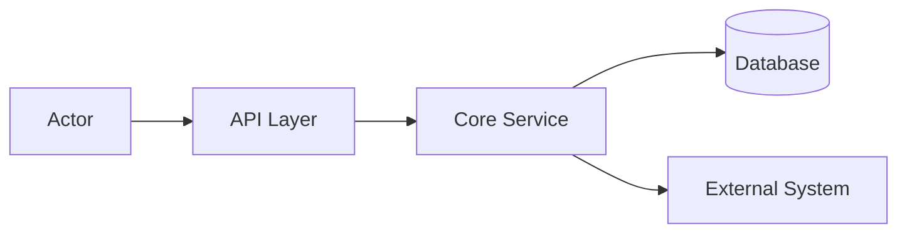

# Architecture Design

Phase 2 of the build lifecycle. Translate approved requirements into a
concrete technical design. **Collaborate with the user** — do not finalize
architecture without their input on key decisions.

**Core principle:** architecture is the contract between requirements and
implementation. Ambiguity here becomes bugs in code.

## When to Use

- After Requirements doc exists (or assumptions are recorded).
- Before writing the implementation plan.
- When choosing between structural alternatives (monolith vs services, sync
  vs async, etc.).

## Mandatory Questions (ask user before fixing design)

### Topology
- Monolith, modular monolith, microservices, layered, event-driven, or
  agent-loop architecture?
- What are the deployment units (single binary, containers per service)?

### Integrations
- What external systems are involved?
- Protocols: REST, gRPC, GraphQL, WebSocket, message queue, MCP, A2A?
- Authentication and authorization between components?

### Data
- Where is state stored? Who owns each data domain?
- Caching strategy? Eventual consistency acceptable?

### Agent-Specific (when building code agents)
- **Context:** what goes in the system prompt vs retrieved docs vs tool output?
- **Memory:** short-term (conversation), long-term (vector store, files) —
  what persists and who reads/writes?
- **Orchestration:** single agent, subagent delegation, parallel tasks?
- **Toolsets:** which tools per agent role; least-privilege boundaries?

### Operations
- Expected load, failure modes, observability needs?
- How does this align with existing CI/CD and deployment patterns?

## Architecture Patterns (selection guide)

| Pattern | When |
|---------|------|
| **Layered** | CRUD apps, clear separation UI → logic → data |
| **Modular monolith** | Single deploy, multiple bounded contexts |
| **Microservices** | Independent scaling, team autonomy, clear domain splits |
| **Event-driven** | Async workflows, loose coupling, high throughput |
| **Agent-loop** | LLM agents with tools, planning, delegation |

Apply KISS: pick the simplest pattern that meets NFRs.

## SOLID at Design Level

- **SRP:** each component/service has one responsibility.
- **OCP:** extend via new modules, not editing core flows.
- **ISP:** narrow integration interfaces — no "do everything" APIs.
- **DIP:** depend on protocol contracts, not concrete implementations.

## Output

Save to: `docs/architecture/<slug>.md`

Link to the requirements doc: `docs/requirements/<slug>.md`.

## Template

```markdown
# Architecture: [Feature Name]

**Status:** draft | approved
**Date:** YYYY-MM-DD
**Requirements:** [link to docs/requirements/<slug>.md]

## Summary

[2-3 sentences: chosen approach and why]

## Context Diagram



## Components

| Component | Responsibility | Technology |
|-----------|----------------|------------|
| [name] | [one-line SRP] | [stack] |

## Integrations

| System | Protocol | Auth | Direction |
|--------|----------|------|-----------|
| [system] | REST/gRPC/MCP | [method] | in/out/both |

## Data Model (high level)

- **Entities:** [list key entities and ownership]
- **Storage:** [DB, files, cache]
- **Consistency:** [strong / eventual]

## Agent Design (if applicable)

### Context Strategy
- System prompt: [what is fixed]
- Retrieved: [docs, RAG, tool output]
- Ephemeral: [conversation turns]

### Memory
| Type | Store | TTL | Access |
|------|-------|-----|--------|
| Short-term | [conversation buffer] | session | current agent |
| Long-term | [vector DB / files] | [policy] | [which agents] |

### Orchestration
- Pattern: [single / subagent / parallel]
- Delegation rules: [when to delegate, to whom]
- Toolset boundaries: [per-agent tool access]

## Cross-Cutting Concerns

- **Logging:** structured JSON, correlation IDs
- **Errors:** retry policy, circuit breakers, user-facing messages
- **Security:** authn/z flow, secrets management, input validation boundaries

## Key Decisions

| Decision | Choice | Rationale | Alternatives considered |
|----------|--------|-----------|------------------------|
| [topic] | [choice] | [why] | [what else] |

## Risks

| Risk | Impact | Mitigation |
|------|--------|------------|
| [risk] | high/med/low | [plan] |

## Open Items

- [ ] [Item needing user decision]
```

## Module Contracts (MANDATORY)

Every architecture artifact MUST contain a `## Module Contracts` section with this table:

```markdown
| Module | Input (API/Event) | Output (API/Event) | Developer |
|--------|-------------------|-------------------|-----------|
| EvolutionEngine | run_cycle(cycle_data) | MutationOutcome | dev-1 |
| SandboxManager | create_sandbox(profile) | SandboxHandle | dev-2 |
| ... | ... | ... | ... |
```

**Without this section, the architecture artifact is REJECTED by the orchestrator.** This is enforced by the `artifact-validation` check (see `multi-agent-orchestration` skill §Managerial Oversight).

## Pitfalls

### Scope creep into future phases
- **Do NOT design Phase B/C modules when the task is Phase A only.** If the requirements specify a three-phase roadmap, the architecture for Phase A should contain ONLY the modules needed for Phase A. Topology operators (ADD_NODE, REMOVE_NODE), Skill Factory Agent, and Agent Graph Sandbox belong in their own architecture documents — not Phase A.
- **Do NOT include pseudocode, Python snippets, or YAML config schemas in architecture.** These are Plan/Implementation artifacts. Architecture defines boundaries, protocols, contracts — not implementation details. Example of what to remove: `assert_safe_path()` implementations, `SandboxProfile.assert_isolated()` methods, `should_rollback()` algorithms.
- **Minimal module count for MVP.** For a Phase A delivery, target 7-8 modules, not 12+. Small modules like `DecisionGate`, `BudgetTracker`, `RollbackMonitor` can be inlined into their parent module for MVP and extracted later. The architecture should note this as a future refactoring, not design 12 separate contracts for the first increment.

### Internal consistency
- **Decision literals MUST match across all diagrams and contracts.** If the Module Contracts table says `{AUTO_APPLY, HUMAN_REVIEW, REJECT}`, the sequence diagram must not show `BLOCKED`, and the Data Contract must not add `BLOCK` without updating the table. Cross-verify before sign-off.
- **Component diagram API signatures MUST match module contract input/output.** If `PromptMutator` contract says `(operator, target, diff)`, the sequence diagram must call it with exactly those parameters.

### Deployment layout
- **Plugin source under the Hermes venv, not `~/.hermes/hermes-agent/`.** The latter is user config space. Verify the actual plugin loading path from `hermes_cli/plugins.py` before fixing deployment paths.
- **Use existing Hermes CLI for operations where possible** — e.g., `hermes profile create --clone` instead of designing a custom profile cloning mechanism.

### A/B testing and metrics
- **Thresholds (10% improvement, 5% degradation) are hypotheses, not fixed gates.** Mark them as initial values requiring calibration in the first 3-5 evolution cycles. Do not hardcode them into architecture contracts as absolutes.
- **Rollback trigger must use the same composite metric as the improvement trigger.** If auto-apply uses `0.5*TSR + 0.3*DQ + 0.2*safety`, rollback must also use this composite, not TSR alone.

### Post-draft blind spots
- **Check existing runtime mechanisms before inventing new ones.** If the design calls for a new engine, new CLI command, new UI surface, or new isolation primitive, verify whether the host already provides it via plugins, hooks, auxiliary tasks, profile management, or delegation. Run `references/idea-generator-checkpoint.md` when in doubt.

## Gate Checklist

Before proceeding to Plan:

- [ ] Requirements doc referenced
- [ ] **Module Contracts section present** (MANDATORY — artifact rejected without it)
- [ ] No pseudocode, Python snippets, or YAML schemas (Plan/Implementation concern)
- [ ] Only Phase A modules designed (Phase B/C deferred to separate artifacts)
- [ ] User consulted on topology and integration choices
- [ ] Component responsibilities are single-purpose (SRP)
- [ ] Integration protocols and auth documented
- [ ] Agent context/memory/orchestration addressed (if agent system)
- [ ] Decision literals consistent across diagrams, contracts, and data flow
- [ ] **Idea Generator Checkpoint run** (see `references/idea-generator-checkpoint.md`) — optional, but mandatory when the artifact proposes new engines, CLI commands, or UIs
- [ ] **User sign-off** obtained (status → approved)
- [ ] Document saved at `docs/architecture/<slug>.md`
