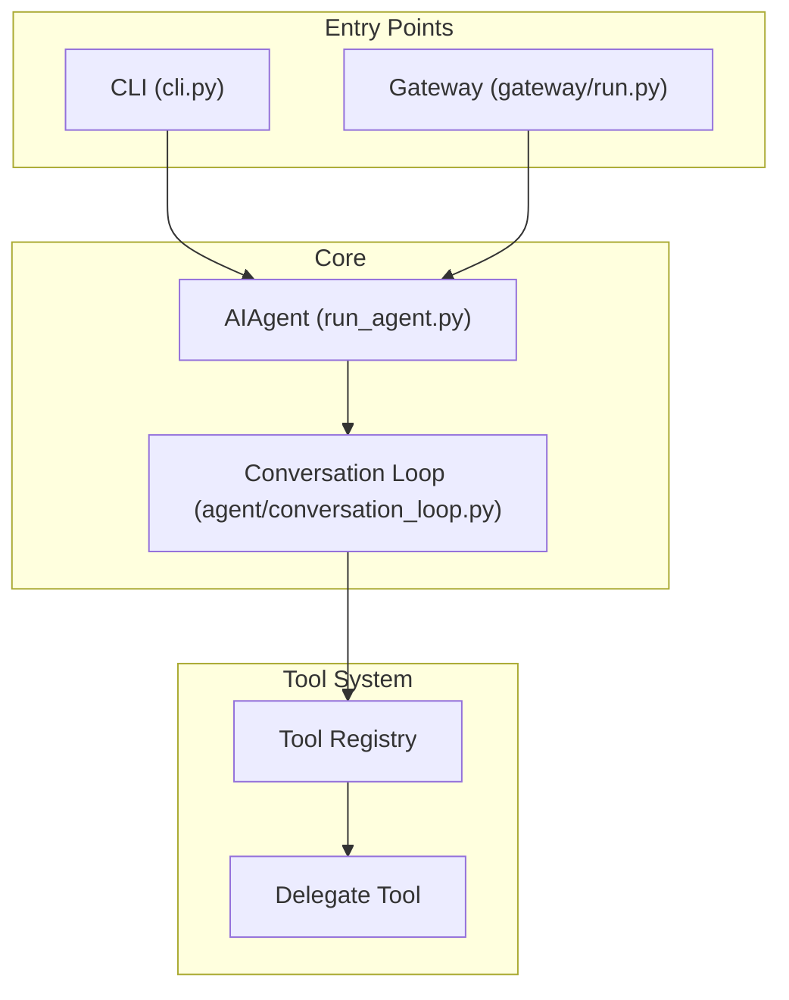

# Architect & System Analyst

This skill combines two complementary roles: **Architect** (describing and designing architecture as executable artifacts) and **System Analyst** (root-cause analysis, requirements decomposition, goal alignment). Use when:

- Asked to «опиши архитектуру» / «describe the architecture» of a codebase
- Building architecture-as-code artifacts (C4, Structurizr DSL, fitness functions)
- Detecting architecture drift between docs and code
- Performing root-cause analysis (5-Whys, Goal Tree)
- Evaluating architectural alternatives (WSM, AHP)
- Setting up automated architecture governance

## Part I: Architecture-as-Code

### The Three Layers of Architecture-as-Code

```
Layer 1: DESCRIPTIVE (C4, Structurizr DSL, Mermaid)
         "This is what the architecture IS"
         → Version-controlled, auto-generated, diffable
         
Layer 2: ENFORCEMENT (ArchUnit, PyTestArch, fitness functions)
         "This is what the architecture MUST be"
         → Automated CI checks, blocking PRs on violations
         
Layer 3: DECISIONS (ADRs, decision logs)
         "This is WHY the architecture is this way"
         → Context preservation, prevents repeated debates
```

### Layer 1: Descriptive — C4 Model + Structurizr DSL

The C4 model (Simon Brown) provides 4 zoom levels:

| Level | Name | Question | Audience |
|-------|------|----------|----------|
| 1 | System Context | How does the system fit in the world? | Everyone |
| 2 | Container | What are the deployable units? | Technical + Business |
| 3 | Component | What are the major structural building blocks? | Developers |
| 4 | Code | How is it implemented? (usually auto-generated) | Developers |

**Structurizr DSL syntax** (reference implementation by Simon Brown):

```groovy
workspace {
    model {
        user = person "User"
        system = softwareSystem "MySystem" {
            api = container "API" "REST API" "FastAPI"
            db = container "Database" "PostgreSQL" { tags "Database" }
        }
        user -> system.api "Uses"
        system.api -> system.db "Reads/Writes"
    }
    views {
        systemContext system { include * }
        container system { include * }
        theme default
    }
}
```

**Quick-start for any codebase:**

```bash
# Step 1: Discover entry points and containers
grep -rl 'def main\|if __name__\|app = ' --include='*.py' | head -10

# Step 2: Map dependencies (who imports whom)
grep -rn '^from\|^import' --include='*.py' | awk -F: '{print $2}' | sort | uniq -c | sort -rn | head -20

# Step 3: Find deployment units
find . -name 'Dockerfile*' -o -name 'docker-compose*' -o -name '*.service' | head -10

# Step 4: Generate C4 DSL (Levels 1-3)
# → Use the template below and fill from grep results
```

**Mermaid (quick inline diagrams):**



### Layer 2: Enforcement — Fitness Functions

Fitness functions (Neal Ford) are architectural tests that run in CI. They check structural rules, not functional behavior.

**Python (PyTestArch + import-linter):**

```python
from pytestarch import Rule, layered_architecture

# Rule: tools/ must not import from gateway/
def test_tools_dont_depend_on_gateway():
    arch = layered_architecture()
        .layer("tools").defined_by("tools")
        .layer("gateway").defined_by("gateway")
    rule = Rule().that_layer("tools").should_not().import_layer("gateway")
    arch.assert_rule(rule)

# Rule: agent/ must not import from cli.py
def test_agent_independent_of_cli():
    rule = Rule().that_modules_in("agent").should_not().import_modules("cli")
    rule.assert_rule()
```

**import-linter (layering contracts in ini/toml):**

```ini
[importlinter]
root_package = hermes

[importlinter:contract:layering]
name = Hermes layering
type = layers
layers =
    hermes_cli
    gateway
    agent
    tools
```

**IMPORTANT — verify actual signatures before writing tests.** The `registry.register()` call in Hermes has this signature (NOT `name, schema, handler, toolset`):
```python
register(self, name, toolset, schema, handler, check_fn=None,
          requires_env=None, is_async=False, description="",
          emoji="", max_result_size_chars=None,
          dynamic_schema_overrides=None, override=False)
```
Always check the real function signature with `grep -A5 'def register'` before documenting it.

**When to write fitness functions:**
- After discovering a drift violation in an audit
- When a new architectural principle is adopted
- Before a major refactoring (as baseline)
- After an incident reveals a hidden coupling

**Rule categories to enforce:**

| Category | Example check | Tool |
|----------|--------------|------|
| Layering | `tools/` → no import from `gateway/` | PyTestArch |
| Dependency | No circular imports between modules | import-linter |
| Size | Files < 2000 lines | custom grep |
| Pattern | Every tool has `register()` call | custom grep |
| Naming | Models end with *Model, services with *Service | PyTestArch |
| Config | No hardcoded API keys in source | custom regex |

### Layer 3: Decisions — ADRs

Architecture Decision Records capture WHY decisions were made. Template:

```markdown
# ADR-NNN: [Title]

**Status:** Proposed | Accepted | Deprecated | Superseded
**Date:** YYYY-MM-DD
**Context:** [What is the problem? No "we should..." — pure context.]
**Decision:** [What did we decide? Concrete, specific.]
**Consequences:**
- ✅ Positive outcome
- ⚠️ Negative trade-off
**Alternatives Considered:**
- Option A: [description] — rejected because [reason]
```

**ADR automation with agents:**
- Phase 10 observers can auto-draft ADRs from cycle findings
- PR diffs → LLM generates ADR drafts (see arxiv 2504.08207 DRAFT)
- `AgenticAKM` (arxiv 2602.04445) — agent-based Architecture Knowledge Management

### Drift Detection Pipeline

Architecture drift = documented architecture ≠ actual code. Detection:

```
1. BASELINE: Parse C4 DSL → extract entities, relationships, rules
2. CURRENT:  Static analysis of codebase → extract actual entities, imports, calls
3. COMPARE:  Diff baseline vs current
4. REPORT:   File:line violations with severity
5. ENFORCE:  CI gate on drift score > threshold
```

**Quick drift check (any codebase):**

```bash
# Compare documented components vs actual directories
diff <(grep "container " docs/architecture/system.dsl | awk '{print $2}' | sort) \
     <(find . -maxdepth 2 -type d ! -path '*/.*' ! -path '*/venv/*' ! -path '*/node_modules/*' | sed 's|./||' | sort)

# Check for undocumented cross-module imports
# (requires documented dependency rules to compare against)
grep -rn 'from gateway' tools/*.py
```

**LLM-assisted drift detection** (ThoughtWorks Radar 2026):
- ArchUnit/Spectral for structural checks
- LLM for semantic drift (e.g., "this module does things its documented responsibility doesn't mention")
- Combined score → drift severity

### SOTA Research Landscape

| Paper | Year | Key Insight |
|-------|------|-------------|
| **ArchAgent** (arxiv 2601.13007) | Jan 2026 | Agent-based framework for legacy architecture recovery. Combines LLM + static analysis for scalable extraction. |
| **LLM-Assisted ROS2 Recovery** (arxiv 2605.20055) | May 2026 | Multi-level hierarchical recovery: blueprint → LLM → staged refinement. Works for real-world ROS2 systems. |
| **Hybrid RE+LLM Pipeline** (arxiv 2511.05165) | Nov 2025 | Extract class diagrams → LLM filters architecturally significant components → generates behavioral view → PlantUML/Structurizr. |
| **DRAFT** (arxiv 2504.08207) | Apr 2025 | LLM-generated ADRs with retrieval augmentation. Beats baseline approaches on 4,911 ADR dataset. |
| **AgenticAKM** (arxiv 2602.04445) | Feb 2026 | Agent-based Architecture Knowledge Management. Multi-agent system for ADR quality improvement. |
| **Architecture Drift + LLMs** (ThoughtWorks) | Apr 2026 | Combining deterministic tools (ArchUnit) + LLM semantic analysis for drift detection. |
| **Living C4** (lmishra.substack) | 2025 | Architecture-as-code → validate like code → block PRs on drift. |
| **Building Evolutionary Architectures** (Ford/Parsons/Kua) | 2024 (2nd ed) | Fitness functions as first-class architectural concern. Evolutionary architecture = guided incremental change across multiple dimensions. |
| **Hexagonal/Ports&Adapters** (Cockburn, revisited 2025) | 2025 | Domain isolation from infrastructure. Alistair Cockburn revisiting the pattern. Enforceable via dependency-direction rules. |

### Additional Tools (Beyond C4/Structurizr)

| Tool | Type | When to use |
|------|------|-------------|
| **D2 / Terrastruct** | Diagram-as-code DSL | Modern alternative to PlantUML. Cleaner syntax, better layout engines. `d2 file.d2 file.svg` |
| **Backstage** (Spotify) | Service catalog | When you have 10+ services and need a developer portal with service inventory, ownership, dependencies |
| **import-linter** (Python) | Dependency enforcement | Enforce layering rules: `tools` must not import `gateway`. CI-integrable. |
| **OpenTelemetry** | Observability | Distributed tracing for architecture: see actual call paths, not just documented ones. MELT (Metrics/Events/Logs/Traces). |
| **ATAM** (SEI) | Tradeoff analysis | When evaluating architecture against quality attributes (performance, security, modifiability). Stakeholder-driven. |

### Architecture Patterns for Enforcement

| Pattern | Key Rule | Fitness Function |
|---------|----------|-----------------|
| **Hexagonal** (Ports & Adapters) | Dependencies point INWARD only. Domain has no infrastructure imports. | `Rule().layer("domain").should_not().import_layer("infrastructure")` |
| **Clean Architecture** | Same as hexagonal + explicit use-case layer | Same + `entities` layer isolated from `use_cases` |
| **Layered** | Each layer only imports the one directly below | `layered_architecture().layer("api").layer("service").layer("data")` |
| **Modular Monolith** | Modules communicate only via published interfaces | `Rule().modules_in("orders").should_not().import_modules("billing.internal")` |

### Deployment Portability Through Architecture

Architecture-as-code directly enables deployment portability:

| Layer | Portability concern | AaC solution |
|-------|---------------------|--------------|
| Config | Hardcoded paths | Env-var resolver in config (`${HERMES_HOME}`, `${USER_HOME}`) |
| State | Machine-specific paths in DB | Path-rewriting migration tool |
| Dependencies | Required external services | Capability detection + graceful degradation |
| Plugins | Hardcoded plugin paths | Self-contained plugin packages with manifest |
| Build | Architecture-specific binaries | Multi-arch Docker buildx + pre-built wheels |

**Portability scale (5 levels):**
```
0 — Stationary     (tied to one machine)
1 — Migratable     (manual file transfer)
2 — Reproducible   (git clone + setup works) ← Hermes current
3 — Cloud-Portable (sync between machines)
4 — Omnipresent    (theoretical ideal)
```

**Key insight:** Check if a path abstraction layer already exists before building one. Hermes has `get_hermes_home()` — the work is using it consistently, not inventing it.

### Portable Deployment Package

After completing architecture-as-code documentation, transform it into a **self-deploying portable package** — a directory of configs, scripts, and verification that deploys identically on any clean machine. The 3-pillar framework:

```
┌──────────────────────────────────────────────┐
│         PORTABLE DEPLOYMENT PACKAGE           │
├──────────────────────────────────────────────┤
│  PILLAR 1: CONFIG                             │
│  ├── config.template.yaml  (${VAR} markers)  │
│  ├── env.template          (keys, paths)     │
│  └── env-var-resolver.py   (resolves ${VAR}) │
│                                               │
│  PILLAR 2: STATE                              │
│  ├── state-export.sh       (Docker volumes)   │
│  ├── state-import.sh       (restore)          │
│  └── migrate-state.py      (path rewriting)   │
│                                               │
│  PILLAR 3: INFRA                              │
│  ├── docker-compose.yml    (multi-arch)       │
│  ├── docker-compose.x86.yml(override for x86) │
│  ├── check-hardware.sh     (arch/GPU/RAM/disk)│
│  ├── setup-firewall.sh     (ports & rules)    │
│  └── deploy.sh             (orchestrator)     │
└──────────────────────────────────────────────┘
```

**Multi-arch Docker strategy:** Ship ONE `docker-compose.yml` (defaulting to arm64). Provide override files for alternative archs (e.g. `docker-compose.x86.yml` with `platform: linux/amd64`). Combine at deploy time: `docker compose -f docker-compose.yml -f docker-compose.x86.yml up -d`. This avoids duplicating service definitions.

**Multi-arch Docker build:** For arm64+amd64 images, use:
```bash
docker buildx build --platform linux/amd64,linux/arm64 \
  -t hermes-agent:latest --push .
```

**Offline deployment** requires pre-loading all Docker images and Python wheels:
```yaml
offline/
├── pip-packages/          # pip download -r requirements.txt -d offline/pip-packages/
├── docker-images/         # docker save ... | gzip > offline/docker-images/name.tar.gz
└── models/                # GGUF files for local inference
```

### Deployment Verification Suite

A complete portable package includes **three gates** of verification, not just one:

```
Gate 1: PRE-DEPLOY  → offline/check-offline.sh
         34+ checks: file existence, YAML validity, Python syntax,
         Docker compose validity, all assets present.
         Must PASS before deploy starts.

Gate 2: IN-DEPLOY   → embedded in deploy.sh
         Prerequisites (Python/Docker/disk version match),
         config template parsing, docker compose start,
         volume creation, firewall rules applied.

Gate 3: POST-DEPLOY → scripts/deploy-verify.sh
         Endpoint health (curl each service),
         container status (docker ps),
         skill loading (hermes skill list),
         delegation test (spawn subagent),
         memory read, firewall rules verified.
         JSON report with PASS/FAIL per check.
```

**Entry structure for each gate check:**
```bash
# Durable, idempotent, with --help and --dry-run
check() {
  local desc="$1"; local cond="$2"
  if eval "$cond"; then echo "  ✓ $desc"; else echo "  ✗ $desc"; fi
}
check "Docker is installed" "command -v docker &>/dev/null"
check "Python >= 3.11" "python3 -c 'import sys; sys.exit(0 if sys.version_info >= (3,11) else 1)'"
```

### D2 as C4 Diagram Language

When choosing a diagram-as-code DSL for C4 models, prefer **D2** over PlantUML or Mermaid for architecture artifacts that need:
- **Layering** — `layers` / `scenarios` built into the language
- **Auto-layout** — `d2 fmt` and multiple layout engines (dagre, elk, tala)
- **Clean syntax** — readable without learning a DSL

**D2 C4 level structure (system context example):**
```d2
direction: right

# Level 1: System Context
user: "User" {
  shape: person
  style: { fill: "#E1F5FE" }
}

system: "Hermes Agent" {
  shape: rectangle
  style: { fill: "#E8F5E9"; stroke: "#2E7D32" }
  containers: {
    cli: "CLI/TUI"
    agent: "AIAgent Core"
    gateway: "Gateway (:8643)"
  }
}

services: {
  neo4j: "Neo4j (:7474)" {
    style: { fill: "#FFF3E0" }
  }
  litellm: "LiteLLM (:4000)" {
    style: { fill: "#FFF3E0" }
  }
}

user -> system: "uses"
system -> neo4j: "queries knowledge graph"
system -> litellm: "routes LLM requests"
```

Place C4 D2 diagrams in a `diagrams/` subdirectory. For multi-file packages, use **one file per C4 level** with `@import` to share styles:
```d2
# c4-level1-context.d2
vars: {
  d2-config: { layout-engine: elk }
}
@import "styles.d2"
# ... model
```

See `references/portable-deployment-package.md` for a real-world example (70 files, 580 KB).

## Part II: System Analysis

### The System Analyst's Toolkit

The System Analyst lives through the ENTIRE development cycle — not just requirements. They ensure that what gets built matches the root cause and goals.

### Tool 1: 5-Whys Root Cause Analysis

Start with the symptom, ask "why?" 5 times:

```
Symptom: «Sub-agents возвращают SIMULATED output вместо реального выполнения команд»

Why 1? → DeepSeek V4 Pro в режиме sub-agent дефолтит к «описанию» действий вместо «выполнения»
Why 2? → Системный промпт sub-agent'а не содержит явного требования ИСПОЛНЯТЬ, а не описывать
Why 3? → Runtime sub-agent'а не различает simulated vs real tool output (нет валидации что tool 
         действительно вызван)
Why 4? → Инфраструктура delegate_task не проверяет tool_trace в результатах sub-agent'а
Why 5? → Нет архитектурного контракта между orchestrator и sub-agent: «execution evidence required»

ROOT CAUSE: Отсутствие architectural contract «execution evidence» в протоколе делегирования.
```

### Tool 2: Goal Tree (Дерево целей)

Decompose the task into sub-goals, then verify every sub-goal has an implementation:

```
ROOT: Заказчик получает качественный код
├── G1: Код корректен (passes tests)
│   ├── G1.1: Unit tests green
│   ├── G1.2: Integration tests pass
│   └── G1.3: Acceptance tests pass ← Phase 8.5
├── G2: Код безопасен (no vulnerabilities)
│   ├── G2.1: SAST scan clean ← Phase 7
│   ├── G2.2: Dependency audit clean
│   └── G2.3: Secrets not in source
├── G3: Код maintainable (читаемый)
│   ├── G3.1: Architecture documented ← Phase 4
│   ├── G3.2: ADRs exist ← Phase 10
│   └── G3.3: No god classes ← Auditor check
└── G4: Код deployed (работает на target)
    ├── G4.1: Deployment successful ← Phase 8
    └── G4.2: Health check green
```

### Tool 3: WSM (Weighted Scoring Matrix)

When choosing between architectural alternatives:

| Criterion | Weight | Alt A: Monolith | Alt B: Microservices | Alt C: Modular Monolith |
|-----------|:------:|:---------------:|:--------------------:|:----------------------:|
| Dev speed | 30% | 9 (2.7) | 5 (1.5) | 8 (2.4) |
| Scalability | 20% | 5 (1.0) | 9 (1.8) | 7 (1.4) |
| Maintainability | 25% | 6 (1.5) | 8 (2.0) | 9 (2.25) |
| Deploy complexity | 15% | 9 (1.35) | 4 (0.6) | 8 (1.2) |
| Team expertise | 10% | 9 (0.9) | 7 (0.7) | 9 (0.9) |
| **TOTAL** | 100% | **7.45** | **6.6** | **8.15** ✅ |

### Tool 4: AHP (Analytic Hierarchy Process)

Only use when criteria weights are independently judged (pairwise comparisons). If derived from WSM weights, skip — adds no new information.

### Verification Gate (Phase 6.5)

After implementation, System Analyst runs 4 checks:

| # | Check | Question | Red Flag |
|---|-------|----------|----------|
| 1 | **Spec conformance** | Does the code match the spec? | Missing features or unplanned features |
| 2 | **Goal tree alignment** | Does every sub-goal have an implementation? | Orphan code with no goal |
| 3 | **Root cause resolved** | Did we fix the cause or the symptom? | Band-aid on systemic issue |
| 4 | **Abstraction level** | Is the fix at the right level? | Fix in UI layer for a data model problem |

**Deviation routing:**
- Scope deviation → back to Requirements (Phase 1)
- Architecture deviation → back to Architect (Phase 4)
- Implementation deviation → back to Developer (Phase 6)

## Architecture Discovery Pipeline (5 Phases)

When documentation is missing (the common case), run:

```
Phase 1: SURFACE SCAN    → What files/modules exist?
Phase 2: STATIC ANALYSIS  → What calls what? (import graph)
Phase 3: RUNTIME TRACE    → What actually runs?
Phase 4: LLM INFERENCE    → What does it mean? (filter + interpret)
Phase 5: ARCHITECTURE-CODE → Structurizr DSL + C4 + ADRs
```

See `architecture-as-code-discovery` skill for full commands per phase.

**For Hermes-specific discovery**, always start with the `hermes-codebase` skill — it already documents the key files, the while-loop architecture, and the subagent lifecycle. Verify against actual code before generating artifacts.

## Output Templates

### Architecture Description (from code)

```markdown
# Architecture: [System Name]

**Discovered from:** [codebase path]
**Method:** 5-phase pipeline + LLM inference
**Date:** YYYY-MM-DD
**Drift baseline:** [hash or tag]

## System Context (C4 Level 1)
[mermaid diagram]

## Containers (C4 Level 2)
[mermaid diagram + component table]

## Components (C4 Level 3)
| Component | Responsibility | File(s) | Fan-in | Fan-out |
|-----------|---------------|---------|--------|---------|

## Cross-Cutting Concerns
- Logging: [pattern]
- Error handling: [pattern]  
- Auth: [pattern]
- Config: [location + format]

## Architecture Decisions (discovered)
| # | Decision | Evidence | Drift risk |
|---|----------|----------|------------|

## Drift Findings
| # | Documented | Actual | File:line | Severity |
|---|-----------|--------|-----------|----------|

## ADRs (auto-generated from discoveries)
[list with status]
```

## Integration with Orchestrator Cycle

In the multi-agent orchestration cycle:

| Phase | Agent | This skill's role |
|-------|-------|-------------------|
| 2 | System Analyst | 5-Whys, Goal Tree, WSM/AHP — root cause + alternatives |
| 4 | Architect | C4 model, module contracts, topology decisions |
| 4.5 | Enterprise Architect | Cross-project standards compliance |
| 6.5 | System Analyst (verification) | 4-check gate: spec, goal tree, root cause, abstraction |
| 10 | Auditor + Critic | Drift detection, fitness function proposals |

## Pitfalls

- **Don't generate diagrams manually.** Use Structurizr DSL or Mermaid — they're version-controllable, diffable, and auto-renderable. Manual diagrams (draw.io, Visio) go stale immediately.
- **Don't document everything.** Document architecturally significant decisions, not implementation details. If it doesn't affect the structure, skip it.
- **Architecture-as-code is LIVING.** Commit the DSL/ADRs to the repo beside the code. Run drift detection in CI. Treat architecture like code — review it, test it, refactor it.
- **Verify, don't assume.** LLM can hallucinate architecture. Every component, relationship, and decision MUST trace to file:line evidence (Phase 1-3).
- **System Analysis ≠ Architecture.** 5-Whys and Goal Tree answer WHY and WHAT. C4 and module contracts answer HOW. Don't confuse the two artifacts.
- **WSM over AHP for most decisions.** AHP requires independent pairwise judgments — rarely available. WSM with explicit weights is faster and equally defensible for most choices.
- **Drift detection without baseline = useless.** Always capture a baseline (hash of import graph + documented components) before claiming drift.
- **Don't design Phase B/C in Phase A's architecture.** Scope creep into future phases bloats the artifact and violates single-responsibility at the document level.
- **Lazy imports are invisible to top-level grep.** When checking dependencies, grep for imports inside function bodies too: `grep -rn 'import' --include='*.py' | grep -v '^.*:#'`. The `_ra()` pattern (lazy `import run_agent`) creates hidden coupling that top-level import analysis misses. Use AST-based analysis for thorough dependency extraction.
- **Knowledge graph verification is mandatory.** An LLM-generated knowledge graph will have 30-45% inaccuracy rate on dependency claims. Always cross-verify with `wc -l`, `grep`, and direct file reads before treating a KG as canonical.
- **Check existing path abstraction before proposing new one.** Many codebases already have a `get_home()` or similar resolver. The problem is inconsistent usage, not missing abstraction. Audit call sites of the existing resolver before proposing a new layer.
- **Docker state lives in volumes, not in ~/.hermes.** A plain copy of `~/.hermes/` will NOT capture Neo4j data, LiteLLM Postgres, or Phoenix state — these live in named Docker volumes. Use `docker volume ls` and `docker volume inspect` to map them.
- **Config files outside the app directory.** LiteLLM config, systemd services, and cron configs often live OUTSIDE `~/.hermes/`. Map all config file locations before claiming a deployment is complete.
