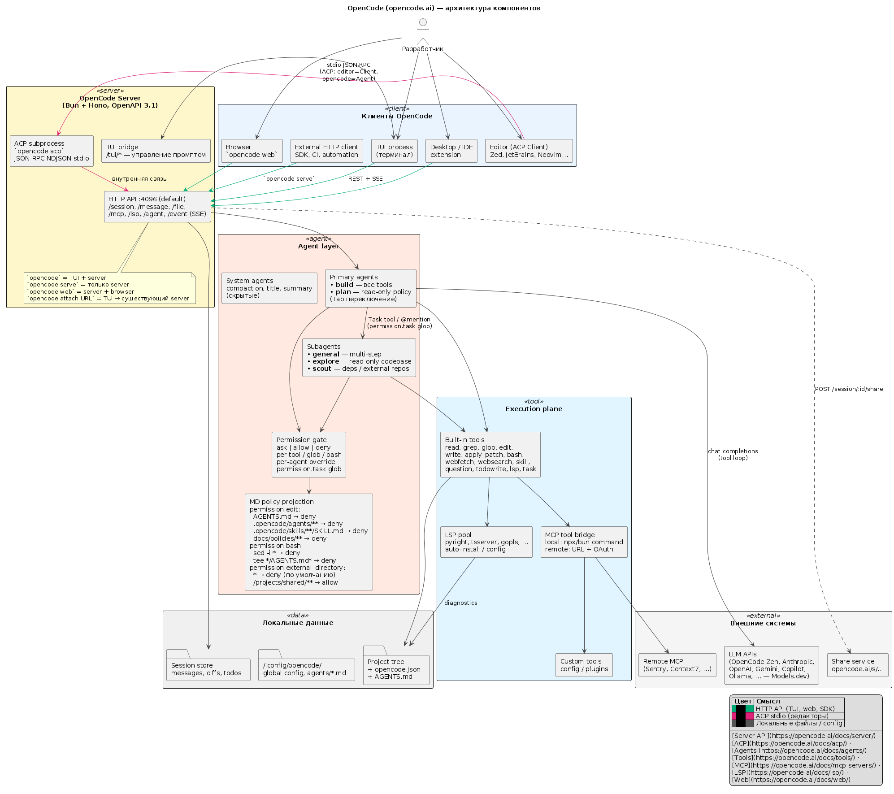
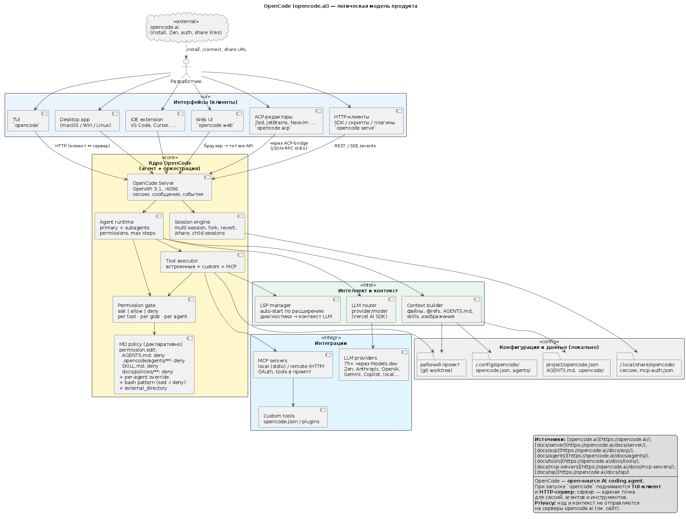
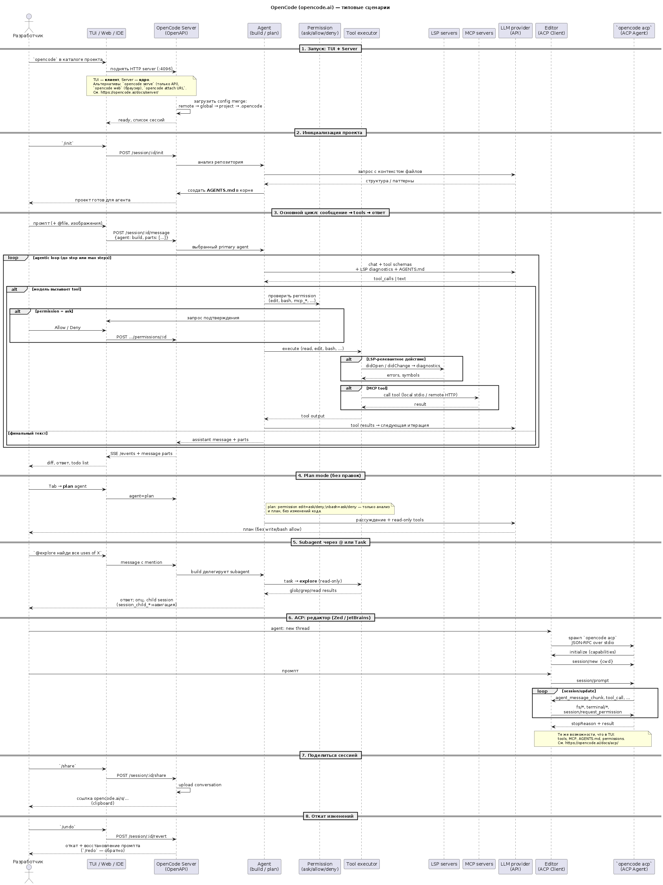

# OpenCode+

Локальный пакет запуска **OpenCode** с **host llama.cpp** (Qwen3.6 + mmproj + **MTP**), **LiteLLM** и Web UI на `http://127.0.0.1:3400`. Вся инструкция — в этой папке; корневые скрипты репозитория не дублируются, только тонкие обёртки.

## Быстрый старт

```bash
# 1) Один раз: пересборка llama.cpp с поддержкой draft-mtp
bash opencode+/rebuild-llama-mtp.sh

# 2) Один раз: opencode на хосте (не Docker)
bash opencode+/install-opencode.sh

# 3) llama + native opencode + Web
bash opencode+/start-all.sh

# 4) Браузер
xdg-open http://127.0.0.1:3400
```

Остановка: `bash opencode+/stop-all.sh`

**OpenCode на хосте** — видит всю ФС (`OPENCODE_WORKSPACE_DIR` = корень репо по умолчанию), bash/tools без ограничений контейнера. LLM напрямую на `http://127.0.0.1:8092/v1` (llama), без Docker для opencode.

---

## Предусловия

| Требование | Проверка |
| ---------- | -------- |
| GPU + CUDA 13.2 | `nvidia-smi`, nvcc в `/usr/local/cuda-13.2` |
| Docker + группа `docker` | `docker info` |
| Workspace `agent_dev` | каталог из `OPENCODE_WORKSPACE_DIR` (по умолчанию `~/agent_dev`) |
| ACL для uid **10102** | `opencode-start.sh` применяет `setfacl` (нужен пакет `acl`) |
| Qwen GGUF + mmproj | пути в `../.env.llamacpp` |
| llama.cpp с MTP | `llama-server --help \| grep draft-mtp` |

Скрипты llama подхватывают `${HOME}` из `.env.llamacpp` и при запуске **от root** автоматически используют home владельца репозитория (`/home/user/...`). Предпочтительно: `sudo -u user bash opencode+/rebuild-llama-mtp.sh`.

Скопируйте опциональные override:

```bash
cp opencode+/.env.example opencode+/.env
# при необходимости: LLM_BACKEND=llamacpp в ../.env.llamacpp
```

---

## MTP (speculative decoding)

**MTP** (`--spec-type draft-mtp`) даёт примерно **2×** скорость decode за счёт draft-токенов. Требует свежей сборки llama.cpp ([PR #22673](https://github.com/ggml-org/llama.cpp/pull/22673)).

| Шаг | Команда |
| --- | ------- |
| Пересборка | `bash opencode+/rebuild-llama-mtp.sh` |
| Проверка флага | `llama-server --help \| grep draft-mtp` |
| Запуск с MTP | `bash opencode+/start-llama-qwen.sh --daemon` |
| Параметры | `LLAMA_CPP_MTP_DRAFT_N_MAX=3` в `opencode+/.env` |

**Acceptance rate** смотрите в логе:

```bash
tail -f opencode+/.run/llama.log
```

Если `draft-mtp` нет в `--help`, скрипт `start-llama-qwen.sh` завершится с подсказкой запустить `rebuild-llama-mtp.sh`.

---

## OpenCode: TUI, Web, ACP

| Режим | Как |
| ----- | --- |
| **Web UI** (default в `start-all`) | `http://127.0.0.1:3400` |
| **TUI** | `docker exec -it opencode opencode` |
| **ACP** (mesh) | `docker exec -i opencode opencode acp` |

Подробности mesh и адаптеров: [`docs/opencode.md`](../docs/opencode.md).

Модель по умолчанию: `litellm/qwen3.6-35b-heretic` → LiteLLM `:4000` → host `llama-server :8090`.

Чтобы LiteLLM ходил в **host llama**, а не в LM Studio:

```env
# ../.env.llamacpp
LLM_BACKEND=llamacpp
```

Затем пересоздайте LiteLLM:

```bash
set -a; source ./.env; source ./.env.llamacpp; set +a
docker compose --env-file ./.env -f ./compose.phoenix.yml up -d --force-recreate litellm
```

---

## Архитектура

Подробный разбор слоёв C0–C4: [`docs/architecture-c1-c4.md`](docs/architecture-c1-c4.md).

Карта папки целиком (граф вызовов, потоки данных, профили, известные баги): [`architecture.md`](architecture.md).

### Продукт OpenCode (upstream)

| Диаграмма | Файл |
| --------- | ---- |
| Компоненты |  |
| Логическая модель |  |
| Сценарии |  |

Исходники PlantUML в [`arch/opencode/`](../arch/opencode/).

---

## Скрипты

| Скрипт | Назначение |
| ------ | ---------- |
| `rebuild-llama-mtp.sh` | CUDA-сборка llama.cpp + проверка `draft-mtp` |
| `start-llama-qwen.sh` | Qwen + mmproj + MTP (`--daemon` для фона) |
| `install-opencode.sh` | Установка opencode CLI на хост |
| `start-opencode.sh` | Native opencode web (:3400), без Docker |
| `stop-opencode.sh` | Остановка host opencode (+ Docker opencode если был) |
| `start-all.sh` | llama → native opencode Web |
| `stop-all.sh` | stop-opencode + llama |

Pid/log llama: `opencode+/.run/llama.pid`, `opencode+/.run/llama.log`.

---

## Skills и MCP

| Тема | Документ |
| ---- | -------- |
| `.ai/skills` | [`docs/skills-options.md`](docs/skills-options.md) |
| MCP / mesh | [`docs/mcp-options.md`](docs/mcp-options.md) |

Кратко: для standalone — **RO mount `.ai/`** + `AGENTS.md`; MCP минимум — **searchbox**; не добавляйте **opencode-adapter** в MCP list (cycle-guard).

---

## Troubleshooting

| Симптом | Действие |
| ------- | -------- |
| `draft-mtp` missing | `bash opencode+/rebuild-llama-mtp.sh` |
| LiteLLM 404 на модель | `LLM_BACKEND=llamacpp`, пересоздать litellm; проверить `docker/litellm/config.yaml` alias |
| `llm-stack-net` not found | `bash ../stack-start.sh` |
| opencode не пишет в workspace | `setfacl` / uid `10102`; см. `opencode-start.sh` |
| Web :3400 недоступен | `bash ../opencode-web-start.sh --restart` |
| MCP loop / 429 | убрать opencode-adapter из `OPENCODE_MCP_SERVERS` |
| llama не стартует | проверить пути GGUF в `.env.llamacpp`, лог `opencode+/.run/llama.log` |

---

## Структура каталога

```
opencode+/
├── README.md                 # эта инструкция
├── architecture.md           # полная карта папки (граф скриптов, профили, баги)
├── .env.example
├── start-llama-qwen.sh
├── rebuild-llama-mtp.sh
├── start-opencode.sh
├── start-all.sh
├── stop-all.sh
├── docs/
│   ├── architecture-c1-c4.md
│   ├── skills-options.md
│   └── mcp-options.md
└── images/                   # копии из arch/opencode/
```

См. также: [`docs/llama-cpp-host.md`](../docs/llama-cpp-host.md), [`../.env.llamacpp.example`](../.env.llamacpp.example).
