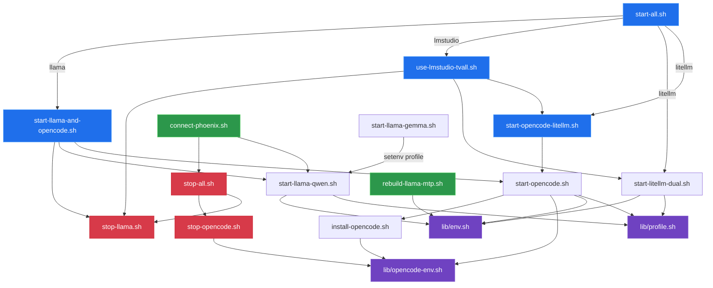
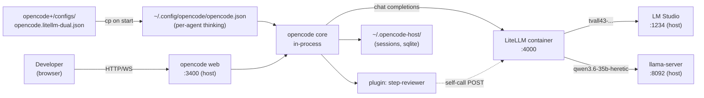

# OpenCode+ — архитектура папки

> Подробное описание содержимого `opencode+/` после аудита от 2026-05-23.
> Цель документа — single source of truth: что зачем, кто кого вызывает,
> что живое, что мёртвое, как чинить если развалится.

## 1. Что это вообще

`opencode+/` — это локальная **обвязка** вокруг апстримового [opencode](https://opencode.ai)
для развёртки на одном хосте (NVIDIA GB10 + Ubuntu 24). Сам opencode CLI ставится
официальным `curl … | bash` в `~/.opencode/bin/opencode`. Эта папка **не форкает**
opencode и **не лежит в `node_modules`** — она содержит только:

- скрипты запуска/остановки в разных конфигурациях (host llama.cpp, LM Studio, LiteLLM-прокси);
- профили `.env` для этих конфигураций;
- шаблон `opencode.json` с per-agent thinking (для Qwen3.6);
- один in-tree плагин `step-reviewer` (LLM-надсмотрщик за шагами агента);
- systemd unit для автостарта web-UI;
- документация и диаграммы.

Главный поток (то, что реально работает «здесь и сейчас»):

```
LM Studio :1234  ─┐
                  ├─► LiteLLM :4000 ─► OpenCode web :3400 ─► Browser
host llama.cpp :8092 ─┘                                         │
                                                                ▼
                                                            пользователь
```

LiteLLM (Docker, `compose.phoenix.yml`, контейнер `litellm`) делает proxy с
логами в Phoenix и подменяемыми model-id; opencode видит её как обычный
OpenAI-совместимый провайдер `litellm`. Per-agent thinking реализован
исключительно через `agent.{name}.options.chat_template_kwargs.enable_thinking`
и работает только когда роутинг идёт в host llama.cpp (LM Studio это поле
игнорирует).

---

## 2. Дерево файлов (после аудита)

Маркеры:

- ★ — активно используется в текущем потоке.
- ◇ — поддерживающий скрипт/конфиг (используется как зависимость другого).
- ○ — устаревшее или относящееся к Docker-варианту, который мы не запускаем.
- × — мёртвый файл (research drafts вне основного потока), кандидат на снос.

```
opencode+/
├── README.md                                ★  главная инструкция (slightly outdated, см. §10)
├── architecture.md                          ★  ← этот документ
├── .env                                     ★  активный override: профиль + workspace + порт
├── .env.example                             ◇  заготовка для .env
│
├── start-all.sh                             ★  оркестратор: llama|lmstudio|litellm
├── start-llama-and-opencode.sh              ◇  llama-direct (без LiteLLM)
├── start-llama-gemma.sh                     ○  обёртка start-llama-qwen.sh с другим профилем
├── start-llama-qwen.sh                      ◇  llama-server c MTP (имеет известный баг — §9)
├── start-litellm-dual.sh                    ★  пересоздаёт docker-контейнер litellm
├── start-opencode.sh                        ★  настоящий запуск opencode web (используется всеми)
├── start-opencode-litellm.sh                ★  thin-wrapper над start-opencode.sh для LiteLLM-режима
├── stop-all.sh                              ★  стопает всё
├── stop-llama.sh                            ★  стопает только llama
├── stop-opencode.sh                         ★  стопает opencode web (+ Docker-opencode если был)
├── use-lmstudio-tvall.sh                    ★  переключатель: llama off → LM Studio + LiteLLM + opencode
├── connect-phoenix.sh                       ◇  для пуска llama на :1234, чтобы Docker LiteLLM мог в неё ходить
├── install-opencode.sh                      ◇  curl-installer opencode CLI на хост
├── rebuild-llama-mtp.sh                     ◇  пересборка llama.cpp с draft-mtp (одноразовая)
│
├── lib/
│   ├── env.sh                               ◇  load_llama_env, llama_help_has_draft_mtp
│   ├── opencode-env.sh                      ◇  load_opencode_env, oc_resolve_binary
│   └── profile.sh                           ◇  load_opencode_plus_profile (читает configs/profiles/*.env)
│
├── configs/
│   ├── opencode.litellm-dual.json           ★  главный шаблон → ~/.config/opencode/opencode.json
│   └── profiles/
│       ├── lmstudio-tvall.env               ★  активный профиль (см. .env)
│       ├── opencode-litellm-dual.env        ★  fallback в start-opencode.sh:45
│       ├── litellm-dual.env                 ★  для пересоздания LiteLLM
│       ├── llama-qwen-heretic.env           ◇  для start-llama-qwen.sh (default)
│       └── llama-gemma-heretic.env          ◇  для start-llama-gemma.sh
│
├── plugins/
│   └── step-reviewer/
│       ├── index.js                         ★  активный плагин (упомянут в opencode.litellm-dual.json)
│       └── package.json                     ★  ESM-маркер
│
├── systemd/
│   ├── opencode-plus.service                ★  юнит для автостарта web (вызывает start-opencode.sh)
│   └── README.md                            ★  инструкция по systemd
│
├── docs/
│   ├── architecture-c1-c4.md                ◇  C0–C4 разбор (упомянут в README.md)
│   ├── opencode-paths.md                    ◇  где что лежит (бинарь, конфиг, state)
│   ├── mcp-options.md                       ○  варианты MCP-подключения (для Docker-варианта)
│   └── skills-options.md                    ○  варианты подключения .ai/skills
│
├── images/                                  ◇  копии диаграмм продукта opencode (из ../arch/opencode/)
│   ├── opencode-product-architecture.png
│   ├── opencode-product-logical.png
│   └── opencode-product-sequences.png
│
├── opencode_claw/                           ×  research-черновики для будущего проекта (см. §11)
│   ├── PLAN.md                              ×  561 строка плана нового проекта
│   ├── plan2.md                             ×  415 строк улучшения плана
│   ├── opinion1.md                          ×  159 строк рассуждений про реалистичность
│   ├── RELATED_WORK.md                      ×  308 строк аналогов
│   ├── kali_mcp.md                          ×  688 строк обзора Kali MCP-серверов
│   ├── kali_purple_mcp.md                   ×  845 строк обзора Kali Purple MCP
│   └── plugin_revie.md                      ◇  77 строк документации step-reviewer (стоит сохранить!)
│
└── .run/                                    ★  runtime: pids, logs, наш start-llama-direct.sh
    ├── llama.pid, llama.log
    ├── opencode-web.pid, opencode-web.log
    ├── start-llama-direct.sh                ★  workaround-launcher для llama (без MTP, на :8092)
    └── (systemd.log при наличии systemd-юнита)
```

---

## 3. Граф вызовов скриптов



Пояснение по entry-points:

| Сценарий | Entry-point | Что получаем |
|---|---|---|
| Дев-стенд: LM Studio + LiteLLM + opencode (текущий **дефолт**) | `bash use-lmstudio-tvall.sh` или `bash start-opencode-litellm.sh` | LM Studio в GUI, LiteLLM на :4000, opencode web :3400 |
| Llama-direct (без LiteLLM, без LM Studio) | `bash start-llama-and-opencode.sh` | host llama-server :8092, opencode напрямую к нему |
| LiteLLM-dual (оба бэкенда) | `bash start-all.sh litellm` | LiteLLM пересоздаётся, opencode на LiteLLM |
| Phoenix-tracing | `bash connect-phoenix.sh` | llama переключается на :1234, LiteLLM рекреэйтится с правильным API_BASE |
| Системный сервис | `systemctl start opencode-plus` | только opencode web; llama руками |

---

## 4. Поток данных в runtime



Ключевые моменты:

- `start-opencode.sh` (line 128) копирует `configs/opencode.litellm-dual.json` поверх
  `~/.config/opencode/opencode.json` **на каждом старте**. Поэтому редактирование живого
  конфига руками теряется при рестарте — править надо шаблон.
- `OPENCODE_HOME=~/.opencode-host` (см. `start-opencode.sh:169`). Все сессии,
  кэши, sqlite БД — там же. Не путать с `~/.opencode/` (оно для Docker-варианта).
- LiteLLM читает `LLAMA_CPP_API_BASE` из env контейнера. Если его пересоздать
  с протухшим env — alias `qwen3.6-35b-heretic` будет указывать на старый порт.
  См. §9 риск-лист.

---

## 5. Per-agent thinking (текущая live-конфигурация)

В `configs/opencode.litellm-dual.json → agent`:

| Агент | mode | Модель (после override) | Thinking | Permissions |
|---|---|---|---|---|
| `build` | primary (стоковый) | `litellm/tvall43-qwen3.6-35b-a3b-heretic` (LM Studio) | OFF | дефолтные |
| `plan` | primary | `litellm/qwen3.6-35b-heretic` (llama.cpp) | **ON** | стоковые plan-policies (edit deny кроме плана) |
| `general` | primary (override) | `litellm/qwen3.6-35b-heretic` | **ON** | дефолтные |
| `summary` | primary, hidden | `litellm/qwen3.6-35b-heretic` | **ON** | дефолтные |
| `deep-explore` | primary (наш custom) | `litellm/qwen3.6-35b-heretic` | **ON** | `edit:deny`, `bash:deny` |
| `explore`, `title`, `compaction` | разные | главный `model` (LM Studio) | OFF | дефолтные |

Wire-формат thinking — `chat_template_kwargs.enable_thinking: true`. Это
qwen3.6-specific; для DeepSeek-V4 / DashScope / MiniMax были бы другие ключи.
LiteLLM пропускает их благодаря `drop_params: false` (см. `docker/litellm/config.yaml:407-413`).

---

## 6. Профили `configs/profiles/*.env`

Каждый профиль — это плоский `.env` файл, читаемый `lib/profile.sh::load_opencode_plus_profile()`.

| Профиль | Кто грузит | Что задаёт |
|---|---|---|
| `lmstudio-tvall.env` | `start-opencode.sh:44` (по умолчанию, если выставлен `OPENCODE_PLUS_CONFIG_TEMPLATE`) | OPENCODE_USE_LITELLM=1, провайдер=litellm, default_model=tvall43, small_model=qwen3.6-heretic, workspace=`~/cursor/first` |
| `opencode-litellm-dual.env` | `start-opencode.sh:45` (fallback), `start-opencode-litellm.sh:14` | то же что lmstudio-tvall, но другой ACTIVE_PROFILE |
| `litellm-dual.env` | `start-litellm-dual.sh:14`, `start-litellm-dual.sh:21` | LMSTUDIO_API_BASE, LLAMA_CPP_API_BASE для пересоздания LiteLLM |
| `llama-qwen-heretic.env` | `start-llama-qwen.sh:13-15` (default через `OPENCODE_PLUS_LLAMA_PROFILE`) | путь к Qwen GGUF + mmproj, порт 8092, MTP=1 |
| `llama-gemma-heretic.env` | `start-llama-gemma.sh:5` (через env-var) | путь к Gemma GGUF, порт 8092, MTP=0 |

Активный профиль выбирается через `OPENCODE_PLUS_ACTIVE_PROFILE` в `opencode+/.env` (сейчас `lmstudio-tvall`).

---

## 7. `.env`-цепочка (важно: порядок наложения)

`start-opencode.sh::load_opencode_env()` (см. `lib/opencode-env.sh:31-65`) читает в порядке:

1. `~/cursor/first/.env`
2. `~/cursor/first/.env.opencode`
3. `opencode+/.env`

Каждый последующий **перезаписывает** одинаковые ключи (через `export`). После env-файлов
загружается профиль через `load_opencode_plus_profile`, и он тоже **перезаписывает**.

`start-llama-qwen.sh::load_llama_env()` (см. `lib/env.sh:40-74`) читает:

1. `~/cursor/first/.env`
2. `~/cursor/first/.env.llamacpp`
3. `opencode+/.env`

И опять каждый перезаписывает. Это и есть тот баг из §9 — `.env.llamacpp` имеет
`LLAMA_CPP_PORT=8090`, а профиль `llama-qwen-heretic.env` ставит `LLAMA_CPP_PORT=8092`,
но **загружается раньше**, поэтому `.env.llamacpp` его клобберит.

---

## 8. Plugin `step-reviewer`

Подключается в `configs/opencode.litellm-dual.json:84-93`:

```json
"plugin": [
  ["opencode+/plugins/step-reviewer", {
    "interval": 10, "historySize": 30,
    "model": "litellm/qwen3.6-35b-heretic"
  }]
]
```

Что делает (см. `plugins/step-reviewer/index.js`):

1. Слушает события `session.next.step.started/ended` и `tool.execute.after`.
2. Каждые 10 шагов берёт последние 30 шагов и шлёт в LiteLLM с system-prompt
   «оцени прогресс / залупа / рекомендация / verdict OK|CAUTION|STUCK».
3. Полученный текст вставляет в system message **следующего** хода через хук
   `experimental.chat.system.transform`.

Эффективно — это «надсмотрщик-агент», который раз в 10 шагов даёт основному агенту
подсказку «ты долбишься в стену, попробуй другое». Использует `qwen3.6-35b-heretic`
(thinking off — потому что в options thinking-флага нет; но в принципе можно добавить
`chat_template_kwargs.enable_thinking: true` в конфиг плагина).

Документация плагина: `opencode_claw/plugin_revie.md` (стоит вынести в `docs/`).

---

## 9. Известные баги / риск-лист

### 9.1 `start-llama-qwen.sh` клобберит профиль

Профиль `llama-qwen-heretic.env` пишет `LLAMA_CPP_PORT=8092` + Qwen llmfan46 GGUF + MTP=1,
но `lib/env.sh::load_llama_env()` загружается **после** профиля и из `.env.llamacpp` ставит
`LLAMA_CPP_PORT=8090` + tvall43 GGUF (без MTP). Итог: tvall43 + 8090 + MTP включается, но
tvall43 не поддерживает MTP, и сервер падает. **Workaround:** `.run/start-llama-direct.sh`
(см. ниже). **Фикс:** в `lib/env.sh:67` сделать `export "$key=..."` условным
(`[ -z "${!key:-}" ]`), чтобы env-файлы не переписывали уже выставленные ключи. Пока **не делалось**.

### 9.2 `.run/start-llama-direct.sh` — текущий workaround

Прямой запуск llama-server с tvall43 GGUF на 8092, без MTP, через `setsid nohup`.
Используется вместо `start-llama-qwen.sh` пока баг §9.1 не починен. Не зависит от профилей,
параметры зашиты в скрипт.

### 9.3 LiteLLM env-cache

Контейнер `litellm` (compose.phoenix.yml:61) читает env только при создании. Если поменял
`.env.llamacpp` (например, порт 8090→8092), нужно `docker compose -f compose.phoenix.yml up -d --no-deps litellm`
с предварительно загруженным `.env.llamacpp` в шелл. См. §10.4 в README после доработки.

### 9.4 systemd unit без проверки LLM

`systemd/opencode-plus.service` стартует только opencode web. Если ни LM Studio,
ни llama не запущены — UI поднимется, но любой запрос будет падать. Это by design
(см. `systemd/README.md:96`).

---

## 10. Что устарело в `README.md`

README писался под Docker-вариант opencode (через `compose.opencode.yml`). Сейчас мы
живём в **native** режиме (host opencode CLI + LiteLLM в Docker). Расхождения:

- README §«Быстрый старт» → `start-all.sh` без аргумента запускает llama-direct;
  для текущего дефолта правильнее `bash use-lmstudio-tvall.sh`.
- README упоминает порт 8090 (старый); реально 8092.
- Ссылка на `docs/llama-cpp-host.md` — файла не существует.
- Раздел «Структура каталога» неполный (нет lib/, plugins/, systemd/, opencode_claw/, configs/profiles/).
- README говорит про uid 10102 / setfacl — это для Docker-opencode, native не нуждается.

Не правлю README в рамках этого аудита (отдельная задача); этот `architecture.md` —
актуальный источник.

---

## 11. `opencode_claw/` — что там и что с этим делать

Папка содержит **research-черновики** для отдельного **будущего** проекта «OpenCode Claw»
(автономный агент-сканер интеграций), от 2026-05-21. Это:

| Файл | Размер | Содержание | Связь с текущим opencode+ |
|---|---|---|---|
| `PLAN.md` | 561 стр | План v0.1 будущего проекта Claw | нет (только ссылается на opencode+ как контекст) |
| `plan2.md` | 415 стр | План v2.0 (улучшение) | нет |
| `opinion1.md` | 159 стр | Анализ реалистичности на Qwen3.6 | нет |
| `RELATED_WORK.md` | 308 стр | Обзор аналогичных open-source решений | нет |
| `kali_mcp.md` | 688 стр | Обзор MCP-серверов для Kali Linux (атакующая сторона) | **никакой** — Kali ≠ opencode+ |
| `kali_purple_mcp.md` | 845 стр | Обзор MCP для Kali Purple (защитная сторона) | **никакой** |
| `plugin_revie.md` | 77 стр | Документация **живого** плагина step-reviewer | прямая (упомянут в plugins/step-reviewer/) |

Эти файлы:

- **никем не импортируются** (проверено `grep` по всему репо — на них нет ссылок снаружи `opencode_claw/`);
- **изолированы** от остального кода;
- **относятся к разным темам** (Claw / Kali pentesting), которые не связаны с opencode+ как обвязкой;
- содержат полезные исследования, которые жалко терять, но они **в git** — выкинуть из текущей папки можно безопасно.

**Рекомендация:** вынести `opencode_claw/` за пределы `opencode+/` (например, в
`docs/` или новую папку `research/`), оставив в `opencode+/docs/step-reviewer.md`
переименованный `plugin_revie.md`. Либо удалить из рабочего дерева — git хранит историю.

Финальное решение по сносу — за пользователем, см. §12.

---

## 12. Кандидаты на удаление / реорганизацию

### Аудит 2026-05-23: что было удалено

| Объект | Размер | Причина |
|---|---|---|
| `diagrams/` (stack-architecture.puml, layers-c1-c4.puml, out/*.png) | ~250 KB | C0–C4 разбор перенесён в этот документ + `docs/architecture-c1-c4.md` (mermaid inline); PNG-дубли больше не нужны |
| `render.sh` | 3.5 KB | Не нужен без `diagrams/` |

### Что сохранено намеренно

| Объект | Размер | Почему |
|---|---|---|
| `opencode_claw/` (PLAN.md, plan2.md, opinion1.md, RELATED_WORK.md, kali_mcp.md, kali_purple_mcp.md, plugin_revie.md) | ~131 KB | Research-черновики; не импортируются, но юзер хочет оставить |
| `images/opencode-product-*.png` | ~620 KB | Копии из `arch/opencode/`, README на них ссылается |
| `docs/mcp-options.md`, `docs/skills-options.md` | ~8 KB | Описывают Docker-вариант (его не используем), но оставлены как историческая справка |

Обязательно **не трогать**:

- любые `start-*.sh`, `stop-*.sh`, `lib/*.sh` — все используются;
- `configs/opencode.litellm-dual.json`, все `configs/profiles/*.env`;
- `plugins/step-reviewer/`;
- `systemd/`;
- `.run/` (рантайм);
- `.env`, `.env.example`;
- `README.md`, `architecture.md`.

---

## 13. TL;DR — что включить в один уикенд

1. **Чтобы поднять стенд с нуля** (после рестарта машины):
   ```bash
   # 1. LM Studio: открыть GUI, загрузить tvall43, включить Local Server :1234
   # 2. (опционально) поднять llama для thinking-агентов:
   bash opencode+/.run/start-llama-direct.sh
   # 3. убедиться что docker-стек запущен:
   bash stack-start.sh        # из корня репо
   # 4. запустить opencode web:
   bash opencode+/start-opencode-litellm.sh
   # 5. браузер:
   xdg-open http://127.0.0.1:3400
   ```

2. **Чтобы потушить всё:**
   ```bash
   bash opencode+/stop-all.sh    # останавливает opencode + llama
   ```

3. **Чтобы добавить нового агента с thinking:** редактировать
   `configs/opencode.litellm-dual.json → agent.{name}` (см. `plan` как образец).
   После правки **перезапустить** opencode (`stop-opencode.sh && start-opencode-litellm.sh`),
   потому что шаблон копируется только на старте.

4. **Чтобы починить `start-llama-qwen.sh`** (отдельная задача из §9.1): в `lib/env.sh:67`
   заменить `export "$key=..."` на условный экспорт, чтобы профиль не клобберился `.env.llamacpp`.

---

## 14. Связи с остальным репозиторием

| Файл вне `opencode+/` | Зачем нужен | Где упоминается |
|---|---|---|
| `~/cursor/first/.env` | LITELLM_API_KEY, LMSTUDIO_*, общий токен docker compose | читается всеми start-*.sh |
| `~/cursor/first/.env.llamacpp` | LLAMA_CPP_API_BASE, путь к GGUF | start-llama-qwen.sh, start-litellm-dual.sh |
| `~/cursor/first/.env.opencode` | OPENCODE_*-варианты (не обязателен) | lib/opencode-env.sh:42 |
| `~/cursor/first/compose.phoenix.yml` | docker сервис litellm + Phoenix | start-litellm-dual.sh, connect-phoenix.sh |
| `~/cursor/first/docker/litellm/config.yaml` | model_list aliases (qwen3.6-35b-heretic, tvall43-…) | LiteLLM container reads on start |
| `~/cursor/first/.ai/` | Agent skills (общий для всех агентов в репо) | start-opencode.sh:165 (symlink в workspace) |
| `~/cursor/first/arch/opencode/` | Источники PlantUML для `images/` | вручную копируется |

---

_Последнее обновление: 2026-05-23. Если что-то расходится с реальностью — это
не баг архитектуры, а пора обновить документ._
