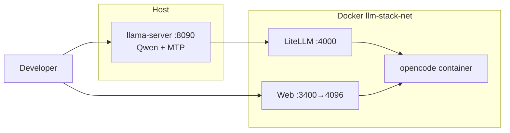
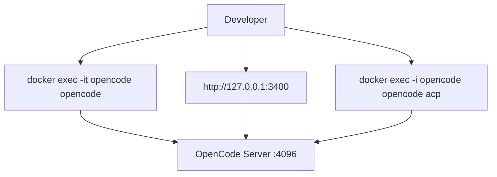
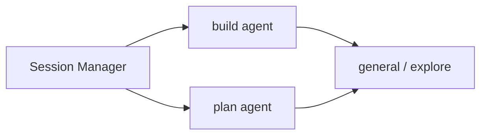
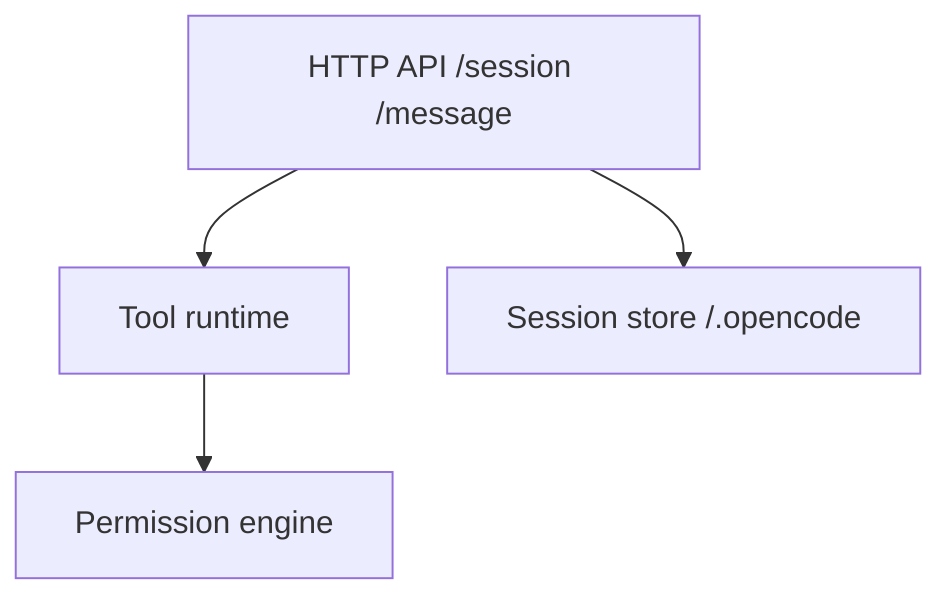
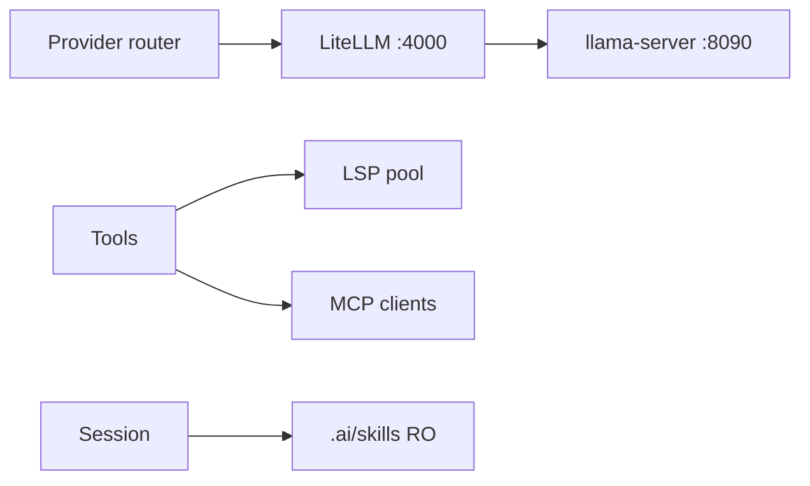

# OpenCode+ — архитектура C0–C4

Документ описывает, как **upstream OpenCode** (продукт) сочетается с **нашим Docker-стеком** (деплой без форка opencode). Логическая модель согласована с [`arch/opencode_with_git/logical.puml`](../../arch/opencode_with_git/logical.puml).

## Обзор уровней

| Уровень | Название | Ответственность | Примеры в OpenCode+ |
| ------- | -------- | ----------------- | ------------------- |
| **C0** | Infrastructure | Host LLM, Compose, сети | `llama-server :8090`, `litellm`, контейнер `opencode`, `llm-stack-net` |
| **C1** | Presentation | Как пользователь или mesh входит в систему | TUI, Web UI `:3400`, `opencode acp` |
| **C2** | Agents | Кто решает задачу | `build` / `plan`, subagents `general` / `explore`, Task tool |
| **C3** | Core runtime | Сессии, tools, permissions | OpenCode Server `:4096`, session store `~/.opencode` |
| **C4** | Platform | Модели, LSP, расширения | LiteLLM provider, LSP pool, MCP, `.ai/skills`, `opencode.json` |

Ключевая идея из сравнения Claw vs OpenCode: **subagents живут в C2**, а **MCP и LLM — в C4** (не наоборот).

## C0 — Infrastructure (деплой)

**Поток данных:** запрос разработчика → OpenCode (C1) → LiteLLM → `host.docker.internal:8090` → llama-server.

**Конфигурация:**

| Файл | Назначение |
| ---- | ---------- |
| `../.env.llamacpp` | `LLM_BACKEND`, `LLAMA_CPP_*`, пути к GGUF |
| `opencode+/.env` | Локальные override (MTP, порты) |
| `../docker/litellm/config.yaml` | Alias `qwen3.6-35b-heretic` → `LLAMA_CPP_API_BASE` |
| `../compose.phoenix.yml` | Сеть `llm-stack-net`, сервис `litellm` |
| `../compose.opencode.yml` | Контейнер `opencode`, mount workspace/state |

**Отличие от upstream:** upstream OpenCode подключается к любому LLM API напрямую; у нас прокси **LiteLLM** в Docker и опциональный **host llama.cpp** с MTP.

**Скрипты OpenCode+:** `start-llama-qwen.sh`, `start-all.sh`, `rebuild-llama-mtp.sh`.

---

## C1 — Presentation

| Интерфейс | Как запустить | Порт / транспорт |
| --------- | ------------- | ---------------- |
| TUI | `bash opencode+/start-opencode.sh` без `--web`, или `docker exec -it opencode opencode` | STDIN/TTY в контейнере |
| Web UI | `start-opencode.sh` / `start-all.sh` (флаг `--web` в корневом `opencode-start.sh`) | `127.0.0.1:3400` → `:4096` |
| ACP | Agent-mesh: `opencode-adapter` → `docker exec -i opencode opencode acp` | JSON-RPC stdio |

**Конфигурация:** `OPENCODE_WEB_HOST_PORT` в `../.env.opencode`, ACL на workspace/state (uid `10102`).

---

## C2 — Agents

| Агент | Политика | Делегирование |
| ----- | -------- | ------------- |
| **build** | Полный доступ к tools (с permission gate) | Task tool, `@mention` subagents |
| **plan** | Read-only, `ask` на edit/bash | То же, но ограниченнее |
| **general** / **explore** | Subagents | Вызываются из primary через Task |

**Конфигурация:** `../docker/opencode/opencode.json` (agents), `AGENTS.md` в workspace, опционально `.opencode/agents/`.

**Отличие от Claw:** у OpenCode subagents — часть **оркестрации задачи** (C2), а не «интеграционный» слой.

---

## C3 — Core runtime

| Компонент | Роль |
| --------- | ---- |
| Session Manager | Multi-session, share, undo/redo |
| Tool runtime | read, edit, grep, bash, task, lsp, … |
| Permission engine | `allow` / `ask` / `deny` per tool/glob |
| Config merger | remote → global → project → `.opencode` → env |

**Конфигурация:**

- `OPENCODE_STATE_DIR` → `/.opencode` в контейнере
- `OPENCODE_WORKSPACE_DIR` → `/workspace/project`
- `permission.edit` glob в `opencode.json` (защита `AGENTS.md`, skills)

**Файлы на хосте:** `~/.opencode` (сессии, web.log), `$HOME/agent_dev` (код).

---

## C4 — Platform

| Расширение | Где настраивается |
| ---------- | ----------------- |
| LLM | `OPENCODE_DEFAULT_MODEL=litellm/qwen3.6-35b-heretic`, `opencode.json` provider |
| LSP | Dockerfile + `OPENCODE_EXTRA_LSP` |
| MCP | `OPENCODE_MCP_SERVERS` в `../.env.opencode` |
| Skills | `OPENCODE_SKILLS_DIR=./.ai` → RO mount (см. [skills-options.md](skills-options.md)) |

**MTP (host):** `--spec-type draft-mtp` ускоряет decode; acceptance rate смотрите в логах `opencode+/.run/llama.log`.

---

## Сводка: upstream vs наш wrap

| Аспект | Upstream OpenCode | OpenCode+ (этот репо) |
| ------ | ----------------- | --------------------- |
| LLM | Прямо к провайдеру / Zen / BYOK | Через LiteLLM → host llama или LM Studio |
| Запуск | `curl install`, локальный бинарь | Docker + `opencode-start.sh` обёртки |
| Web | `opencode web` локально | Порт `3400` на loopback, процесс в контейнере |
| Skills | `.opencode/skills`, plugins | Общий `.ai/` + `AGENTS.md` |
| Mesh | Опционально ACP | `opencode-adapter` + MCP adapters (см. [mcp-options.md](mcp-options.md)) |

Дополнительно: [skills-options.md](skills-options.md), [mcp-options.md](mcp-options.md), [README.md](../README.md).
